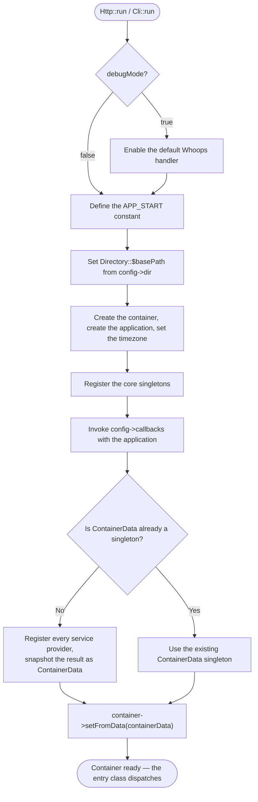
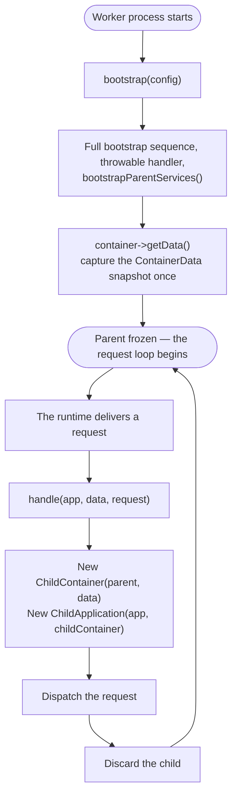

# The Application

The application class, `Valkyrja\Application\Kernel\Valkyrja`, ties a Valkyrja
project together. It holds the container, carries the config, and collects the
component providers. An entry class bootstraps it once at the entry point.

This component also carries the entry classes, the config classes, the
`Directory` path helper, and the built-in component providers. This document
covers each in turn:

- [Entry Points](#entry-points) — HTTP, CLI, and the persistent worker
  runtimes
- [Configuration](#configuration) — the three config classes, environment
  sourcing, your own config class, and callbacks
- [The Bootstrap Sequence](#the-bootstrap-sequence) — what `run()` does, step
  by step
- [Accessing the Application](#accessing-the-application) — the
  `ApplicationContract` surface
- [The Provider Hierarchy](#the-provider-hierarchy) — component providers and
  how to write one
- [Built-in Component Providers](#built-in-component-providers) — the shipped
  aggregators
- [Directories](#directories) — path resolution through `Directory`
- [Framework Information](#framework-information) — the `ApplicationInfo`
  constants
- [Exceptions](#exceptions) — the component's throwable hierarchy
- [Debug Mode](#debug-mode) — what `debugMode` enables
- [Persistent Worker Lifecycle](#persistent-worker-lifecycle) — request
  isolation in a long-running process

## Entry Points

Do not instantiate `Valkyrja` directly. Use an entry class:

- `Valkyrja\Application\Entry\Http` — PHP-FPM / CGI web applications
- `Valkyrja\Application\Entry\Cli` — console applications
- Worker entry classes — persistent worker runtimes (see
  [Persistent Worker Lifecycle](#persistent-worker-lifecycle))

Every entry class extends `Valkyrja\Application\Entry\Abstract\App`, which
holds the shared bootstrap. Each bootstrap step on `App` is a public static
method, so a subclass overrides one step without copying the rest.

### HTTP (PHP-FPM / CGI)

`Http::run()` takes an `HttpConfigContract`, bootstraps the application, and
dispatches the current request through the HTTP request handler:

```php
// app/public/index.php
use Valkyrja\Application\Data\HttpConfig;
use Valkyrja\Application\Entry\Http;

require __DIR__ . '/../vendor/autoload.php';

Http::run(new HttpConfig(
    namespace:   'App',
    dir:         __DIR__ . '/..',
    environment: 'production',
    debugMode:   false,
    timezone:    'UTC',
    key:         'your-application-key',
));
```

### CLI

`Cli::run()` takes a `CliConfigContract`, bootstraps the application, and
dispatches the input built from `$_SERVER['argv']` through the CLI input
handler:

```php
// app/bin/cli
use Valkyrja\Application\Data\CliConfig;
use Valkyrja\Application\Entry\Cli;

require __DIR__ . '/../vendor/autoload.php';

Cli::run(new CliConfig(
    namespace:          'App',
    dir:                __DIR__ . '/..',
    environment:        'production',
    debugMode:          false,
    timezone:           'UTC',
    key:                'your-application-key',
    applicationName:    'myapp',
    defaultCommandName: 'list',
));
```

The examples spell out the arguments that an application commonly sets, and
some shown values equal the constructor defaults. Pass a named argument to set
a value, and omit the arguments you do not change.

### Persistent Workers

The worker entry classes live in this package. Each extends
`Valkyrja\Application\Entry\Abstract\WorkerHttp` and adds its runtime's
request loop:

| Class                                                  | Runtime                                                          |
| ------------------------------------------------------ | ---------------------------------------------------------------- |
| `Valkyrja\Application\Entry\FrankenPhp\FrankenPhpHttp` | [FrankenPHP](https://frankenphp.dev/docs/worker/)                |
| `Valkyrja\Application\Entry\OpenSwoole\OpenSwooleHttp` | [OpenSwoole](https://openswoole.com/)                            |
| `Valkyrja\Application\Entry\RoadRunner\RoadRunnerHttp` | [RoadRunner](https://docs.roadrunner.dev/docs/php-worker/worker) |

Each worker class exposes the same static `run()` method as `Http`, and each
takes the concrete `HttpConfig` class. `run()` bootstraps once, then serves
every request from the same process (see
[Persistent Worker Lifecycle](#persistent-worker-lifecycle) for the isolation
model).

#### FrankenPHP

FrankenPHP runs the entry file as its worker script. Point the `worker`
directive of your Caddyfile at this file:

```php
// app/public/index.php — the FrankenPHP worker script
use Valkyrja\Application\Data\HttpConfig;
use Valkyrja\Application\Entry\FrankenPhp\FrankenPhpHttp;

require __DIR__ . '/../vendor/autoload.php';

FrankenPhpHttp::run(new HttpConfig(
    dir: __DIR__ . '/..',
));
```

The loop reads `$_SERVER['MAX_REQUESTS']` through `getMaxRequests()`. The
worker exits after that many requests, and `0` (the default) means no limit.
The request closure catches every throwable, so one failed request does not
stop the worker. The loop runs `gc_collect_cycles()` after each request, so
garbage collection does not trigger in the middle of a response.

#### OpenSwoole

OpenSwoole requires the `openswoole` extension and the `openswoole/core`
package. The entry file is a long-running server process:

```php
// app/bin/swoole
use Valkyrja\Application\Data\HttpConfig;
use Valkyrja\Application\Entry\OpenSwoole\OpenSwooleHttp;

require __DIR__ . '/../vendor/autoload.php';

OpenSwooleHttp::run(new HttpConfig(
    dir: __DIR__ . '/..',
));
```

The default server listens on `127.0.0.1:9501`. Override `getSwooleServer()`
in a subclass to change the address:

```php
use OpenSwoole\Http\Server;
use Valkyrja\Application\Entry\OpenSwoole\OpenSwooleHttp;

class AppSwooleHttp extends OpenSwooleHttp
{
    public static function getSwooleServer(): Server
    {
        return new Server('0.0.0.0', 8080);
    }
}
```

Override `onStart()` to run code when the server starts. The class converts
each OpenSwoole request into a framework request, dispatches it through an
isolated child application, and writes the framework response back through the
OpenSwoole response.

#### RoadRunner

RoadRunner requires the `spiral/roadrunner-http` package. The entry file is
the PHP worker that the RoadRunner server starts:

```php
// app/worker.php — the RoadRunner worker script
use Valkyrja\Application\Data\HttpConfig;
use Valkyrja\Application\Entry\RoadRunner\RoadRunnerHttp;

require __DIR__ . '/vendor/autoload.php';

RoadRunnerHttp::run(new HttpConfig(
    dir: __DIR__,
));
```

Point the `server.command` of your `.rr.yaml` at this file:

```yaml
server:
  command: 'php worker.php'
```

The loop waits on the RoadRunner relay for each request and exits when the
relay closes. The class converts each RoadRunner request into a framework
request, dispatches it through an isolated child application, and responds
through the worker relay.

### Customizing an Entry Class

`Http::getRequest()` builds the request from the PHP superglobals, and
`Cli::getInput()` builds the input from `$_SERVER['argv']`. Override either in
a subclass to change how the framework reads its input:

```php
use Valkyrja\Application\Entry\Http;
use Valkyrja\Http\Message\Request\Contract\ServerRequestContract;
use Valkyrja\Http\Message\Request\Factory\RequestFactory;

class AppHttp extends Http
{
    public static function getRequest(): ServerRequestContract
    {
        // Build a request that parses an `application/json` body.
        return RequestFactory::jsonFromGlobals();
    }
}
```

The same pattern applies to the other bootstrap steps: `getContainer()`
returns the container to use, `getApplication()` returns the application to
use, and `getThrowableHandler()` returns the debug-mode throwable handler.

## Configuration

Configuration is a typed PHP object. There is no `.env` reader and no flat
array registry. Three config classes exist, one per entry type. `HttpConfig`
and `CliConfig` do not extend `Config`. Each of the two classes implements its
own contract (`HttpConfigContract`, `CliConfigContract`) and repeats the base
properties. Both contracts extend `ConfigContract`, and the entry classes
discriminate on the contract: `Http::run()` requires an `HttpConfigContract`,
and `Cli::run()` requires a `CliConfigContract`.

Convention: hold your application's real values in the config object that the
entry point builds. Create one config file per environment, or read the values
from an env file in your own bootstrap, and pass them as constructor
arguments. The constructor defaults are generic placeholders, not production
values.

### Base Properties

`Valkyrja\Application\Data\Config` carries the properties that all three
classes share:

| Property        | Default                          | Description                                          |
| --------------- | -------------------------------- | ---------------------------------------------------- |
| `namespace`     | `'App'`                          | The application's root namespace                     |
| `dir`           | `__DIR__`                        | The application's root directory — set it explicitly |
| `version`       | `ApplicationInfo::VERSION`       | The application's version string                     |
| `environment`   | `'production'`                   | The environment name                                 |
| `debugMode`     | `false`                          | Enable the Whoops throwable handler                  |
| `timezone`      | `'UTC'`                          | PHP's default timezone, set at boot                  |
| `key`           | `'some_secret_app_key'`          | The application secret key — always override it      |
| `dataPath`      | `'App/Provider/Data'`            | The framework does not read this property            |
| `dataNamespace` | `'App\\Provider\\Data'`          | The framework does not read this property            |
| `providers`     | `[ApplicationComponentProvider]` | The component providers to load                      |
| `callbacks`     | `[]`                             | Callables the bootstrap invokes with the application |

Every property is `public readonly`, so any code that holds the config reads
the values directly (`$config->environment`). The bootstrap registers the
config in the container. See
[Accessing the Application](#accessing-the-application).

### HTTP Properties

`Valkyrja\Application\Data\HttpConfig` repeats the base properties, changes
the `providers` default to `[HttpApplicationComponentProvider]`, and adds
seven middleware lists. Each entry is a middleware class name.

| Property                    | Default                                                                       |
| --------------------------- | ----------------------------------------------------------------------------- |
| `requestReceivedMiddleware` | `[]`                                                                          |
| `routeMatchedMiddleware`    | `[]`                                                                          |
| `routeNotMatchedMiddleware` | `[ViewRouteNotMatchedMiddleware::class]`                                      |
| `routeDispatchedMiddleware` | `[]`                                                                          |
| `throwableCaughtMiddleware` | `[LogThrowableCaughtMiddleware::class, ViewThrowableCaughtMiddleware::class]` |
| `sendingResponseMiddleware` | `[]`                                                                          |
| `responseSentMiddleware`    | `[]`                                                                          |

### CLI Properties

`Valkyrja\Application\Data\CliConfig` repeats the base properties, changes the
`providers` default to `[CliWithHttpApplicationComponentProvider]`, and adds
two names and six middleware lists:

| Property                    | Default                                                                         |
| --------------------------- | ------------------------------------------------------------------------------- |
| `applicationName`           | `'valkyrja'` — the binary name in version and help output                       |
| `defaultCommandName`        | `'list'` — the command run when no command argument is given                    |
| `inputReceivedMiddleware`   | help, version, and global-interaction option checks                             |
| `routeMatchedMiddleware`    | `[]`                                                                            |
| `routeNotMatchedMiddleware` | `[CheckCommandForTypoMiddleware::class]`                                        |
| `routeDispatchedMiddleware` | `[]`                                                                            |
| `throwableCaughtMiddleware` | `[LogThrowableCaughtMiddleware::class, OutputThrowableCaughtMiddleware::class]` |
| `processExitingMiddleware`  | `[]`                                                                            |

### Sourcing Values From the Environment

Because the config is plain PHP, any source can supply a value. Read the
environment in the entry file itself, or in a bootstrap file the entry file
includes:

```php
// app/public/index.php
use Valkyrja\Application\Data\HttpConfig;
use Valkyrja\Application\Entry\Http;

require __DIR__ . '/../vendor/autoload.php';

Http::run(new HttpConfig(
    dir:         __DIR__ . '/..',
    environment: $_ENV['APP_ENV'] ?? 'production',
    debugMode:   ($_ENV['APP_DEBUG'] ?? 'false') === 'true',
    key:         $_ENV['APP_KEY'] ?? throw new RuntimeException('APP_KEY is not set'),
));
```

The framework does not populate `$_ENV`. Populate it with your web server, the
worker runtime, or an env-file loader that runs before the config is built.
Fail loudly for a required value, as the `key` line shows. A silent default
for a secret is a production incident.

### Your Own Config Class

The built-in config classes are one way to start, not the only way.
`Http::run()` requires an `HttpConfigContract`, and `Cli::run()` requires a
`CliConfigContract`. Any class that fulfills the contract works with those two
entry classes. The worker entry classes are stricter: each worker `run()`
requires the concrete `HttpConfig` class, so a config for a worker runtime
must extend it.

The simplest form extends a built-in class and bakes in your own defaults.
The entry file then constructs one class per environment, and each class
carries the values that hold for that environment:

```php
// app/Config/ProductionHttpConfig.php
use Valkyrja\Application\Data\HttpConfig;

class ProductionHttpConfig extends HttpConfig
{
    public function __construct(string $key)
    {
        parent::__construct(
            namespace:   'App',
            dir:         dirname(__DIR__),
            environment: 'production',
            debugMode:   false,
            key:         $key,
        );
    }
}
```

```php
// app/public/index.php
Http::run(new ProductionHttpConfig(
    key: $_ENV['APP_KEY'] ?? throw new RuntimeException('APP_KEY is not set'),
));
```

A config class can also implement the contract directly, with no built-in
parent. The contracts declare `get`-hooked properties, so any class that
declares the properties fulfills them. Reach for this form when your config
carries its own structure. That structure can hold computed values, your own
value objects, or properties the built-in classes do not have. This form works
with `Http::run()` and `Cli::run()` only; a worker `run()` rejects it, because
the worker entry classes require the concrete `HttpConfig` class.

### Config Callbacks

The `callbacks` array holds callables of the shape
`callable(ApplicationContract):void`. The bootstrap invokes each one with the
application after the core singletons register and before the container data
loads. The callbacks run on every boot. Use the callbacks only for work that
must happen each time.

Their main use case is pre-registering a prebuilt `ContainerData` singleton.
When a callback sets one, the bootstrap skips the service-provider
registration step and fills the container from the prebuilt object (see
[The Bootstrap Sequence](#the-bootstrap-sequence)):

```php
use Valkyrja\Application\Data\HttpConfig;
use Valkyrja\Application\Kernel\Contract\ApplicationContract;
use Valkyrja\Container\Data\ContainerData;

new HttpConfig(
    callbacks: [
        static function (ApplicationContract $app): void {
            /** @var ContainerData $data */
            $data = require __DIR__ . '/../data/container-data.php';

            $app->getContainer()->setSingleton(ContainerData::class, $data);
        },
    ],
);
```

`ContainerData` is a readonly value object with four maps: `aliases`,
`callbacks`, `services`, and `singletons`. The container snapshots the same
four maps after a full provider registration. Any source can supply the
object: a required PHP file, a generated class, or a cache.

## The Bootstrap Sequence

`run()` calls `App::start()`, which bootstraps the application:

1. When `debugMode` is `true`, `start()` enables a default Whoops handler
   before any other step, so a bootstrap failure renders a stack trace.
2. `start()` defines the `APP_START` constant with the current microtime,
   unless an earlier entry defined it. Measure elapsed time against it.
3. `start()` sets `Directory::$basePath` from `config->dir` (see
   [Directories](#directories)).
4. `getContainer()` creates the container, and `getApplication()` creates the
   application. The application's constructor sets PHP's default timezone from
   `config->timezone`.
5. `bootstrapServices()` registers the core singletons.
6. The application invokes each config callback with itself.
7. `loadContainerData()` fills the container, through the `ContainerData` gate
   described below.



The core singletons are the config, `ContainerContract`, and
`ApplicationContract`. The bootstrap registers the config under
`ConfigContract` and under its concrete class. When the config implements
`CliConfigContract` or `HttpConfigContract`, the bootstrap registers the same
config object as a singleton under that contract too.

The `ContainerData` branch is the extension point for the callbacks. The
callbacks run before the container data loads. A callback that sets a prebuilt
`ContainerData` singleton skips the service-provider registration step. When no
callback does, `ContainerServiceProvider::publishData()` registers every
service provider from `getContainerProviders()` and snapshots the container as
`ContainerData`.

After `start()` returns, the entry class finishes the boot:

1. When `debugMode` is `true`, the entry class registers a
   `WhoopsThrowableHandler` as the `ThrowableHandlerContract` singleton and
   enables it (see [Debug Mode](#debug-mode)).
2. `Http` resolves `RequestHandlerContract` and runs the request from
   `getRequest()`. `Cli` resolves `InputHandlerContract` and runs the input
   from `getInput()`. A worker enters its request loop.

## Accessing the Application

The bootstrap registers the application in the container as
`ApplicationContract`. Resolve it from any service provider:

```php
use Valkyrja\Application\Kernel\Contract\ApplicationContract;

$app = $container->getSingleton(ApplicationContract::class);

$app->getContainer();   // ContainerContract
$app->getDebugMode();   // bool   — config->debugMode
$app->getEnvironment(); // string — config->environment
$app->getVersion();     // string — config->version
```

The full `ApplicationContract` surface:

| Method                       | Returns                       | Description                                            |
| ---------------------------- | ----------------------------- | ------------------------------------------------------ |
| `getContainer()`             | `ContainerContract`           | The container                                          |
| `publishProviderCallbacks()` | `void`                        | Invoke each config callback — the bootstrap calls this |
| `getProviders()`             | `ComponentProviderContract[]` | The expanded, flat component provider list             |
| `getContainerProviders()`    | `ServiceProviderContract[]`   | Every component's service providers, merged            |
| `getEventProviders()`        | `ListenerProviderContract[]`  | Every component's listener providers, merged           |
| `getCliProviders()`          | `CliRouteProviderContract[]`  | Every component's CLI route providers, merged          |
| `getHttpProviders()`         | `HttpRouteProviderContract[]` | Every component's HTTP route providers, merged         |
| `getDebugMode()`             | `bool`                        | `config->debugMode`                                    |
| `getEnvironment()`           | `string`                      | `config->environment`                                  |
| `getVersion()`               | `string`                      | `config->version`                                      |

The config is a singleton too. Resolve it under `ConfigContract` for the
shared properties, or under the entry-specific contract for the full set:

```php
use Valkyrja\Application\Data\Contract\ConfigContract;
use Valkyrja\Application\Data\Contract\HttpConfigContract;

$config = $container->getSingleton(ConfigContract::class);

$config->key; // the application secret key

// In an HTTP application the same object also resolves under HttpConfigContract:
$httpConfig = $container->getSingleton(HttpConfigContract::class);

$httpConfig->routeNotMatchedMiddleware; // the middleware class list
```

In practice, most code should depend on specific services rather than on the
application object. The application is a framework-level concern.

## The Provider Hierarchy

A component provider is the top-level unit, listed in `config->providers`. It
implements `Valkyrja\Application\Provider\Contract\ComponentProviderContract`,
which has five methods:

```text
config->providers[]
  └── ComponentProviderContract
        ├── getComponentProviders() → ComponentProviderContract[] (dependencies)
        ├── getContainerProviders() → ServiceProviderContract[]
        ├── getEventProviders()     → ListenerProviderContract[]
        ├── getCliProviders()       → CliRouteProviderContract[]
        └── getHttpProviders()      → HttpRouteProviderContract[]
```

Each method receives the `ApplicationContract` and returns instances of the
matching contract:

| Method                    | Element contract                                                    | Registers             |
| ------------------------- | ------------------------------------------------------------------- | --------------------- |
| `getComponentProviders()` | `Valkyrja\Application\Provider\Contract\ComponentProviderContract`  | Dependency components |
| `getContainerProviders()` | `Valkyrja\Container\Provider\Contract\ServiceProviderContract`      | Container services    |
| `getEventProviders()`     | `Valkyrja\Event\Provider\Contract\ListenerProviderContract`         | Event listeners       |
| `getCliProviders()`       | `Valkyrja\Cli\Routing\Provider\Contract\CliRouteProviderContract`   | CLI commands          |
| `getHttpProviders()`      | `Valkyrja\Http\Routing\Provider\Contract\HttpRouteProviderContract` | HTTP routes           |

**Service providers** map service ids to resolution logic in the container.
**Route providers** (CLI and HTTP) register commands and routes. **Listener
providers** register event listeners. Each component's own README documents
its provider contract. The application collects each kind lazily, on the first
call to the matching `get*Providers()` method, and caches the result. Nothing
is instantiated at collection time. The framework pays the cost when a service
is first requested.

### Writing a Component Provider

A typical application declares one component provider of its own, returns its
child providers from the five methods, and lists the component provider in the
config after a built-in aggregator:

```php
namespace App\Provider;

use Valkyrja\Application\Kernel\Contract\ApplicationContract;
use Valkyrja\Application\Provider\Contract\ComponentProviderContract;

class AppComponentProvider implements ComponentProviderContract
{
    public function getComponentProviders(ApplicationContract $app): array
    {
        // Components this component depends on. They register before this one.
        return [
            new BlogComponentProvider(),
        ];
    }

    public function getContainerProviders(ApplicationContract $app): array
    {
        return [new AppServiceProvider()];
    }

    public function getEventProviders(ApplicationContract $app): array
    {
        return [new AppListenerProvider()];
    }

    public function getCliProviders(ApplicationContract $app): array
    {
        return [new AppCliRouteProvider()];
    }

    public function getHttpProviders(ApplicationContract $app): array
    {
        return [new AppHttpRouteProvider()];
    }
}
```

Return `[]` from a method whose kind the component does not provide. Then list
the provider in the config:

```php
use Valkyrja\Application\Data\HttpConfig;
use Valkyrja\Application\Provider\HttpApplicationComponentProvider;

new HttpConfig(providers: [
    new HttpApplicationComponentProvider(),
    new AppComponentProvider(),
]);
```

Passing a `providers` value replaces the default list. Include an aggregator
(or the framework component providers you need) explicitly, because the
framework's own services register through the same mechanism.

### Loading Order

**Sub-component providers**, returned by `getComponentProviders()`, declare the
components a component depends on. `Valkyrja::collectProviders()` expands the
list depth-first: it adds each sub-provider before the provider that declares
it. A component's dependencies therefore register first, and the declaring
component registers after them. List order in `config->providers` is preserved
for the top-level entries.

For the config above the flat list is: the aggregator's dependencies, the
aggregator, `BlogComponentProvider`, `AppComponentProvider`. The expansion
does not dedupe: a provider declared in two places appears twice in the flat
list.

## Built-in Component Providers

The framework ships four aggregators in `Valkyrja\Application\Provider`. Each
declares framework components through `getComponentProviders()` and returns
`[]` from the other four methods.

| Provider                                  | Composition                                                                                         | Default for  |
| ----------------------------------------- | --------------------------------------------------------------------------------------------------- | ------------ |
| `ApplicationComponentProvider`            | Container, Event                                                                                    | `Config`     |
| `CliApplicationComponentProvider`         | `ApplicationComponentProvider` + CLI Interaction, Middleware, Routing, Server + Log                 | —            |
| `CliWithHttpApplicationComponentProvider` | `CliApplicationComponentProvider` + HTTP Message, Middleware, Routing, RoutingCli, Server           | `CliConfig`  |
| `HttpApplicationComponentProvider`        | `ApplicationComponentProvider` + HTTP Message, Middleware, Routing, RoutingCli, Server + Log + View | `HttpConfig` |

Choose by application shape:

- `ApplicationComponentProvider` is the minimal core: the container and the
  event components only. Use it when you compose every other component
  yourself.
- `CliApplicationComponentProvider` serves a pure console application with no
  HTTP surface.
- `CliWithHttpApplicationComponentProvider` serves a console application whose
  commands work with HTTP routing data. An application that has both a web and
  a console entry is the common case.
- `HttpApplicationComponentProvider` serves a web application; it has no CLI
  components.

List an aggregator alongside your own provider:

```php
use Valkyrja\Application\Data\HttpConfig;
use Valkyrja\Application\Provider\HttpApplicationComponentProvider;

new HttpConfig(providers: [
    new HttpApplicationComponentProvider(),
    new AppComponentProvider(),
]);
```

## Directories

`Valkyrja\Application\Directory\Directory` resolves every framework path. The
bootstrap sets `Directory::$basePath` from `config->dir`, and each helper
builds an absolute path from it. Each helper takes an optional path to append:

```php
use Valkyrja\Application\Directory\Directory;

Directory::basePath();                 // /path/to/app
Directory::publicPath('index.php');    // /path/to/app/public/index.php
Directory::storagePath();              // /path/to/app/storage
Directory::logsStoragePath('app.log'); // /path/to/app/storage/logs/app.log
```

| Helper                        | Resolves to (relative to the base path) |
| ----------------------------- | --------------------------------------- |
| `basePath()`                  | ``                                      |
| `appPath()`                   | `app`                                   |
| `dataPath()`                  | `data`                                  |
| `envPath()`                   | `env`                                   |
| `publicPath()`                | `public`                                |
| `resourcesPath()`             | `resources`                             |
| `srcPath()`                   | `src`                                   |
| `storagePath()`               | `storage`                               |
| `frameworkStoragePath()`      | `storage/framework`                     |
| `frameworkStorageCachePath()` | `storage/framework/cache`               |
| `logsStoragePath()`           | `storage/logs`                          |
| `testsPath()`                 | `tests`                                 |
| `vendorPath()`                | `vendor`                                |

Each segment name comes from a public static property (`$appPath`,
`$storagePath`, and so on). Assign a property before the paths are used to
rename a directory:

```php
use Valkyrja\Application\Directory\Directory;

Directory::$storagePath = 'var';

Directory::logsStoragePath('app.log'); // /path/to/app/var/logs/app.log
```

`Directory::path()` is the joining helper: it prepends a `/` to a relative
path and passes through an empty or absolute one.

## Framework Information

`Valkyrja\Application\Constant\ApplicationInfo` carries the framework's own
identity constants:

| Constant                  | Holds                              |
| ------------------------- | ---------------------------------- |
| `VERSION`                 | The framework version string       |
| `VERSION_BUILD_DATE_TIME` | The build datetime of that version |
| `ASCII`                   | The Valkyrja ASCII-art banner      |
| `ICON`                    | The default CLI banner icon        |

`ApplicationInfo::VERSION` is the default for `config->version`, so an
application that does not set `version` reports the framework version from
`ApplicationContract::getVersion()`. Set `version` to report your
application's own version.

## Exceptions

Every exception this component throws implements
`Valkyrja\Application\Throwable\Contract\ApplicationThrowable`, which extends
the framework-wide `ValkyrjaThrowable`. Two abstract bases exist for the
component's exceptions: `ApplicationInvalidArgumentException` and
`ApplicationRuntimeException` in
`Valkyrja\Application\Throwable\Exception\Abstract`.

Catch `ApplicationThrowable` to handle every exception from this component,
or `ValkyrjaThrowable` to handle every framework exception, without masking
unrelated errors.

## Debug Mode

`debugMode: true` enables the Whoops throwable handler in two places:

1. `App::start()` enables a default handler first, before any other bootstrap
   step, so a bootstrap failure renders a stack trace.
2. After bootstrap, the entry class registers a `WhoopsThrowableHandler` as the
   `ThrowableHandlerContract` singleton and enables it.

That is the whole effect. `debugMode` changes no other bootstrap behavior.
Override `getThrowableHandler()` in an entry subclass to use a different
handler.

Warning: Whoops output exposes internal details. Never set `debugMode: true`
in production.

## Persistent Worker Lifecycle

In a persistent worker runtime, one PHP process handles many requests. State
from one request bleeds into the next unless the framework isolates it.
`Valkyrja\Application\Entry\Abstract\WorkerHttp` implements the isolation; the
three concrete classes in the table above supply each runtime's request loop.

The invariant: **the parent application and its container are frozen after
`bootstrap()` returns.** Every request gets its own `ChildContainer` and
`ChildApplication`, and the worker discards both when the request ends.



### Bootstrap (once, at worker startup)

`bootstrap()` takes one `HttpConfigContract` and returns the application:

```php
$app = static::bootstrap($config);

$container = $app->getContainer();
$data      = $container->getData(); // captured once, reused for each request
```

`getData()` returns a `ContainerData` value object that holds the parent
container's maps. PHP arrays are copy-on-write, so each child receives a
logical copy at no cost until the child writes to a map.

### Per-Request Handling

`handle($app, $data, $request)` serves one request, in four overridable steps:

1. `getChildContainer()` creates a `ChildContainer` from the parent and the
   `ContainerData` snapshot.
2. `getChildApplication()` wraps the parent application and the child
   container in a `ChildApplication`.
3. `bootstrapChildContainer()` registers the child application and the child
   container as the child's `ApplicationContract` and `ContainerContract`
   singletons, so request-scoped resolution stays in the child.
4. `handleRequest()` resolves `RequestHandlerContract` from the child and runs
   the request.

The `ChildContainer` reads its own maps first and falls back to the parent
through `ContainerContract`. A singleton resolved in the child stays in the
child. The `ChildApplication` returns the child container from
`getContainer()` and delegates every other `ApplicationContract` method to the
parent.

`FrankenPhpHttp` uses `handle()` directly, because the PHP SAPI emits the
response. `OpenSwooleHttp` and `RoadRunnerHttp` mirror the same pipeline but
return the framework response, because their runtimes emit it: each dispatches
through the child's request handler, applies the sending-response middleware,
sets the response as the child's `ResponseContract` singleton, and terminates
the handler before the runtime writes the response out.

### Customizing the Parent

Override `bootstrapParentServices()` to resolve in the parent whatever every
request should share. An id resolved here lives in the frozen parent, and each
child reuses that one instance. A child still delegates any other id to the
parent, and the parent answers it as it would for any caller, except a
parent-declared alias onto a target the parent has not resolved, which the child
resolves itself. The base implementation resolves the route collection, so an
override calls `parent::bootstrapParentServices($app)` first.

### Swapping the Child Container

Two `ChildContainer` implementations exist in `Valkyrja\Container\Manager`:

- `ChildContainer` (the default) delegates to the parent through
  `ContainerContract`, so any parent that implements the contract works.
- `NativeChildContainer` reads the parent's protected fields directly for a
  lower construction cost. It requires a concrete `Container` parent and takes
  no `ContainerData`. The two differ on the factory receiver: a factory bound on
  the parent receives the child here, and the parent under `ChildContainer`. A
  parent-declared alias onto a target the parent has already resolved is the
  exception, because both hand that call to the parent. Choose the behavior your
  services need, not the construction cost alone.

To swap the implementation, override `getChildContainer()` in your concrete
worker subclass.

### A Complete Worker Subclass

One subclass combines both extension points. The subclass adds extra parent
services and a different child container:

```php
namespace App\Entry;

use Valkyrja\Application\Entry\FrankenPhp\FrankenPhpHttp;
use Valkyrja\Application\Kernel\Contract\ApplicationContract;
use Valkyrja\Container\Data\ContainerData;
use Valkyrja\Container\Manager\Container;
use Valkyrja\Container\Manager\Contract\ContainerContract;
use Valkyrja\Container\Manager\NativeChildContainer;
use Valkyrja\Http\Routing\Matcher\Contract\MatcherContract;

class AppWorkerHttp extends FrankenPhpHttp
{
    public static function bootstrapParentServices(ApplicationContract $app): void
    {
        parent::bootstrapParentServices($app);

        // Share the route matcher across requests instead of rebuilding it per child.
        $app->getContainer()->getSingleton(MatcherContract::class);
    }

    public static function getChildContainer(ApplicationContract $app, ContainerData $data): ContainerContract
    {
        $parent = $app->getContainer();

        assert($parent instanceof Container);

        return new NativeChildContainer($parent);
    }
}
```

The entry file then calls the subclass instead of the shipped class:

```php
// app/public/index.php — the FrankenPHP worker script
use App\Entry\AppWorkerHttp;
use Valkyrja\Application\Data\HttpConfig;

require __DIR__ . '/../vendor/autoload.php';

AppWorkerHttp::run(new HttpConfig(
    dir: __DIR__ . '/..',
));
```
