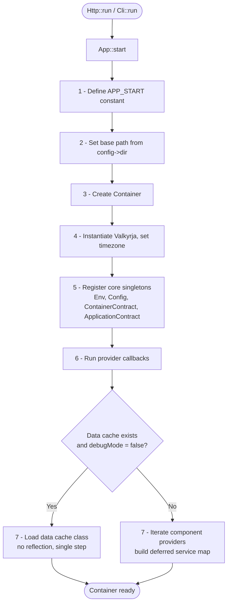
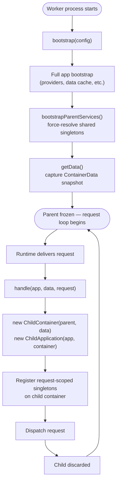

# The Application

## Introduction

The `Application` class — `Valkyrja\Application\Kernel\Valkyrja` — is the
central object that ties a Valkyrja project together. It holds the container,
carries the configuration, coordinates component loading, and exposes the
runtime environment to every part of the framework.

In practice you will rarely interact with the application object directly. Its
role is structural: it exists to be bootstrapped once at the entry point, then
live quietly in the container while the rest of the framework does its work.
Understanding what it does and how it is assembled makes everything else in the
framework predictable.

## Entry Classes

You do not instantiate `Valkyrja` directly. The entry classes handle this:

- `Valkyrja\Application\Entry\Http` — for traditional PHP-FPM / CGI web
  applications
- `Valkyrja\Application\Entry\Cli` — for console applications
- Persistent worker entry classes — for long-running worker runtimes (
  see [Persistent Worker Lifecycle](#persistent-worker-lifecycle))

The following worker runtime integrations are available as separate packages,
each extending `Valkyrja\Application\Entry\Abstract\WorkerHttp`:

| Package               | Class                                | Runtime                                                          |
|-----------------------|--------------------------------------|------------------------------------------------------------------|
| `valkyrja/frankenphp` | `Valkyrja\FrankenPhp\FrankenPhpHttp` | [FrankenPHP](https://frankenphp.dev/docs/worker/)                |
| `valkyrja/openswoole` | `Valkyrja\OpenSwoole\OpenSwooleHttp` | [OpenSwoole](https://openswoole.com/)                            |
| `valkyrja/roadrunner` | `Valkyrja\RoadRunner\RoadRunnerHttp` | [RoadRunner](https://docs.roadrunner.dev/docs/php-worker/worker) |

### Standard (PHP-FPM / CGI)

`Http` and `Cli` expose a single static `run()` method. Call it with your
configuration object and the framework handles everything from bootstrap to
response:

```php
// app/public/index.php
use Valkyrja\Application\Data\HttpConfig;
use Valkyrja\Application\Entry\Http;

Http::run(new HttpConfig(
    dir: __DIR__ . '/..',
));
```

```php
// app/bin/cli
use Valkyrja\Application\Data\CliConfig;
use Valkyrja\Application\Entry\Cli;

Cli::run(new CliConfig(
    dir: __DIR__ . '/..',
    applicationName: 'myapp',
));
```

These entry classes exist so that improvements to the bootstrap sequence
propagate to all projects without requiring manual updates to your entry point
files.

## Configuration

The application is configured through typed PHP objects. There is no `.env`
reader, no flat array configuration, and no magic key-value registry.
Configuration is PHP — typed, IDE-visible, statically analyzable, and fast.

### Base Configuration

`Valkyrja\Application\Data\Config` carries properties common to all application
types:

| Property        | Default                 | Description                                                  |
|-----------------|-------------------------|--------------------------------------------------------------|
| `namespace`     | `'App'`                 | Your application's root namespace                            |
| `dir`           | `__DIR__`               | The application's root directory (set this explicitly)       |
| `version`       | framework version       | Your application version string                              |
| `environment`   | `'production'`          | The current environment name                                 |
| `debugMode`     | `false`                 | Bypass data cache; enable verbose error output               |
| `timezone`      | `'UTC'`                 | PHP's default timezone, set at boot                          |
| `key`           | `'some_secret_app_key'` | Application secret key — **always override this**            |
| `dataPath`      | `'App/Provider/Data'`   | Relative path where generated data cache classes are written |
| `dataNamespace` | `'App\\Provider\\Data'` | PHP namespace for generated data cache classes               |
| `providers`     | framework defaults      | The component providers to load, in order                    |
| `callbacks`     | `[]`                    | Callables invoked on the application after bootstrap         |

Because configuration is plain PHP, any property can be set from any source:

```php
new Config(
    environment: $_ENV['APP_ENV'] ?? 'production',
    debugMode:   ($_ENV['APP_DEBUG'] ?? 'false') === 'true',
    key:         $_ENV['APP_KEY'] ?? throw new RuntimeException('APP_KEY is not set'),
);
```

### HTTP Configuration

`HttpConfig` extends `Config` with no additional properties of its own. Its
purpose is to act as a typed discriminator — `Http::run()` enforces that it
receives an `HttpConfig` rather than a base `Config` — and to carry a default
`providers` list that includes the HTTP-specific component providers.

### CLI Configuration

`CliConfig` extends `Config` with these additional properties:

| Property             | Default            | Description                                         |
|----------------------|--------------------|-----------------------------------------------------|
| `applicationName`    | `'valkyrja'`       | The binary name, shown in version and help output   |
| `defaultCommandName` | `'list'`           | The command run when no command argument is given   |
| `http`               | `new HttpConfig()` | An embedded `HttpConfig` for HTTP services from CLI |

The embedded `http` property means a CLI application can access HTTP routing
services — useful for commands that generate HTTP route data or interact with
HTTP-specific configuration.

> Note: In order for your cli application to be able to use HTTP services, you
> must include the HTTP component in your application's component providers.

## The Bootstrap Sequence

When `run()` is called, `App::start()` executes in order:

1. **`APP_START` is defined.** The constant is set to the current microtime,
   giving you a precise benchmark reference point available anywhere in the
   application.

2. **The base path is set.** `Directory::$basePath` is set to `config->dir`. All
   framework path resolution — including generated data file locations — uses
   this as its root.

3. **The container is created.** A new `Container` instance is instantiated.

4. **The application is instantiated.** `Valkyrja` is created with the container
   and the config. The timezone is set immediately from `config->timezone`.

5. **Core singletons are registered.** `Env`, `Config`, the concrete config
   subclass, `ContainerContract`, and `ApplicationContract` are injected
   directly into the container as singletons. If `CliConfig` is in use, its
   embedded `HttpConfig` is also registered.

6. **Provider callbacks are published.** The `callbacks` array from your config
   is iterated and each callable is invoked with the application instance. These
   run unconditionally, cached or not — use them only for work that genuinely
   must happen on every boot.

7. **Components are loaded.** The container data is populated, either from the
   data cache or from providers (see below).

### Bootstrap Flowchart



## Component Loading and the Data Cache

After the application is instantiated, Valkyrja populates the container. This is
where its performance model becomes tangible.

### Without the Data Cache

When `debugMode` is `true` or no data cache class exists, the application loads
components fresh. It calls `getContainerProviders()` on the application, which
collects all container service providers from every registered component
provider and registers them into the container's deferred service map. Routes
and listeners are loaded from `getHttpProviders()`, `getCliProviders()`, and
`getEventProviders()` when those services are first accessed.

Nothing is instantiated during this phase — the container maps service IDs to
their resolution logic. Cost is paid only when a service is requested.

### With the Data Cache

When a data cache class exists and `debugMode` is `false`, the framework loads
the pre-generated class directly. The container is populated in a single step
with no provider iteration, no binding logic, and no reflection. This is what
makes Valkyrja faster than a micro-framework in production.

Regenerate the cache after any deployment that changes providers, routes, or
services:

```bash
php app/bin/cli data:generate        # CLI routing data
php app/bin/cli http:data:generate   # HTTP routing data
```

> Note: That a service provider must exist that provides the data classes
> respective for each of the components you expect to load data from with debug
> mode disabled. Otherwise, even with debug mode disabled, the default data
> class will be generated via the same logic loop as without the data cache.

## The Provider Hierarchy

Understanding the provider hierarchy makes the entire system predictable.

```
config->providers[]
  └── ComponentProvider          implements ProviderContract
        ├── getContainerProviders()  → ServiceProvider[]
        ├── getEventProviders()      → EventProvider[]
        ├── getCliProviders()        → CliRouteProvider[]
        └── getHttpProviders()       → HttpRouteProvider[]
```

> Note: These are recommended names for the classes.
>
> ServiceProvider implements
> Valkyrja\Container\Provider\Contract\ProviderContract or extends
> Valkyrja\Container\Provider\Provider
> EventProvider implements Valkyrja\Event\Provider\Contract\ProviderContract or
> extends Valkyrja\Event\Provider\Provider
> HttpRouteProvider implements
> Valkyrja\Http\Routing\Provider\Contract\ProviderContract or extends
> Valkyrja\Http\Routing\Provider\Provider
> CliRouteProvider implements
> Valkyrja\Cli\Routing\Provider\Contract\ProviderContract or extends
> Valkyrja\Cli\Routing\Provider\Provider

**Component providers** are the top-level unit, listed in `config->providers`.
Each represents a logical component of your application — your own app code, a
package, or a framework component. A component provider may optionally implement
`PublishableProviderContract`, which adds a `publish(ApplicationContract $app)`
method that **always runs, cached or not**. Use this only for registrations that
truly cannot be deferred.

> Note: The `publish` callback is called before the container is filled with any
> services. You must be cautious to list your callbacks after any callbacks
> that would load the container with data. You also do not need to use the
> contract if you do not wish to, as you will define the callback explicitly in
> the config. However, this can allow you to quickly see any component providers
> that do have callbacks

**Service providers** live inside component providers and are returned by
`getContainerProviders()`. They declare which services they provide and publish
them on first, or any (services and callables), access.

**Route providers** (CLI and HTTP) live inside component providers and are
returned by `getCliProviders()` and `getHttpProviders()`. They declare which
controller classes and pre-built route objects to register into the route
collection.

**Event providers** live inside component providers and are returned by
`getEventProviders()`. They declare which listener classes and pre-built
listener objects to register into the event collection.

The key rule: **anything that can be deferred should be deferred.** Registering
services, routes, or listeners in `publish()` defeats the caching mechanism
entirely.

## Accessing the Application

The application instance is registered in the container as
`ApplicationContract`. Resolve it from any service provider:

```php
use Valkyrja\Application\Kernel\Contract\ApplicationContract;

$app = $container->getSingleton(ApplicationContract::class);

$app->getContainer();     // ContainerContract
$app->getDebugMode();     // bool
$app->getEnvironment();   // string
$app->getVersion();       // string
```

In practice, most code should depend on specific services rather than on the
application object. The application is a framework-level concern.

## Component Providers

Service providers live inside **component providers**, which are the top-level
organisational unit of a Valkyrja application. A component provider extends
`Valkyrja\Application\Provider\Abstract\Provider` or implements
`Valkyrja\Application\Provider\Contract\ProviderContract`. It groups the service
providers, CLI route providers, HTTP route providers, and event listener
providers that make up a logical component of your application.

Component providers are registered in your config's `providers` array. When the
application boots, it calls `getContainerProviders()`, `getEventProviders()`,
`getCliProviders()`, and `getHttpProviders()` on each component provider to
collect all child providers.

```php
use Valkyrja\Application\Kernel\Contract\ApplicationContract;
use Valkyrja\Application\Provider\Abstract\Provider;

class AppComponentProvider extends Provider
{
    public static function getContainerProviders(ApplicationContract $app): array
    {
        return [
            CacheServiceProvider::class,
            MailServiceProvider::class,
        ];
    }

    public static function getHttpProviders(ApplicationContract $app): array
    {
        return [
            AppRouteProvider::class,
        ];
    }

    public static function getEventProviders(ApplicationContract $app): array
    {
        return [
            AppEventProvider::class,
        ];
    }
}
```

A component provider may additionally implement `PublishableProviderContract`,
which adds a `publish(ApplicationContract $app)` method that **runs on every
boot, cached or not**. Use this only for registrations that genuinely cannot be
deferred. Binding services or routes here defeats the caching mechanism
entirely.

## Debug Mode

Setting `debugMode: true` has two effects:

1. The data cache is bypassed entirely — components always load fresh from
   providers on every request.
2. Valkyrja installs Whoops as the throwable handler, rendering detailed stack
   traces in the browser or terminal.

Never run with `debugMode: true` in production. The performance difference is
significant enough, and Whoops output may expose internal details that should
remain private.

## Persistent Worker Lifecycle

Persistent worker runtimes (where a single PHP process handles many requests
without restarting) require a different architecture from PHP-FPM. In PHP-FPM
every request gets a clean process. In a worker, state accumulated during one
request will bleed into the next unless it is explicitly isolated.

Valkyrja's abstract worker entry class,
`Valkyrja\Application\Entry\Abstract\WorkerHttp`,
implements the isolation pattern. Concrete subclasses integrate with a specific
worker runtime. The abstract class provides the `bootstrap()` and `handle()`
methods; subclasses supply the request loop and any runtime-specific request
conversion.

### The Invariant

The parent application and its container are **frozen** after `bootstrap()`
completes. No code should write to them again. Every request receives its own
`ChildContainer` and `ChildApplication` that inherit from the frozen parent but
write only to child-local state. When the request ends, the child is discarded.

### Bootstrap (once, at worker startup)

```php
$app = static::bootstrap($config, $env);

$container = $app->getContainer();
$data      = $container->getData(); // captured once, reused each request
```

`bootstrap()` runs the full application bootstrap sequence and then calls
`bootstrapParentServices()`. The returned `$app` and the snapshot `$data`
are captured in the closure or loop scope before any request arrives.

`getData()` returns a `ContainerData` value object holding the parent
container's maps. It is captured **once**, outside the request loop, and
passed to every child. Because PHP arrays are copy-on-write, each child gets
its own logical copy at zero cost until it writes to one of the maps.

### Per-Request Handling

```php
// Inside the worker request loop:
static::handle($app, $data, $request);
```

`handle()` creates a fresh `ChildContainer` and `ChildApplication` for each
request:

```
ChildContainer($parent, $data)     ← inherits parent maps; writes stay local
ChildApplication($app, $container) ← owns child container; delegates everything else to parent
```

`ChildApplication` owns the child container and returns it from `getContainer()`.
Every other method — `getEnvironment()`, `getVersion()`, `getProviders()`,
`getDebugMode()`, and so on — delegates directly to the parent application. No
re-bootstrapping occurs. The child is a thin wrapper that swaps in a fresh
container while keeping the rest of the parent's state intact.

The child container checks its own maps first and falls back to the parent via
the `ContainerContract` interface. Singletons resolved in the child are cached
in the child only. The parent's `instances` map is never written to after
`bootstrap()`.

### Lifecycle Flowchart

<p align="center"><a href="https://valkyrja.io" target="_blank">
    
</a></p>



### Customising Bootstrap

Override `bootstrapParentServices()` to force-resolve services that are
expensive to create and safe to share across requests — for example, the route
collection:

```php
protected static function bootstrapParentServices(ApplicationContract $app): void
{
    $container = $app->getContainer();
    $container->getSingleton(CollectionContract::class);
    $container->getSingleton(MyExpensiveSharedService::class);
}
```

Anything resolved here lives in the frozen parent and is shared (read-only)
across all requests. Anything not resolved here will be created fresh in each
request's child container, which is correct but pays the creation cost on
every request.

### Child Container Variants

Two `ChildContainer` implementations are available:

- **`Valkyrja\Container\Manager\ChildContainer`** (default) — delegates to the
  parent via `ContainerContract`. Works with any parent that implements the
  contract and is portable to any language or runtime.

- **`Valkyrja\Container\Manager\NativeChildContainer`** — accesses the parent's
  protected fields directly for slightly lower overhead at construction.
  Requires
  a concrete `Container` parent and is PHP-only. Use only when profiling
  confirms
  a bottleneck at worker child construction rates.

The abstract worker entry class uses `ChildContainer` by default. Swap in
`NativeChildContainer` by overriding `handle()` in your concrete subclass.
