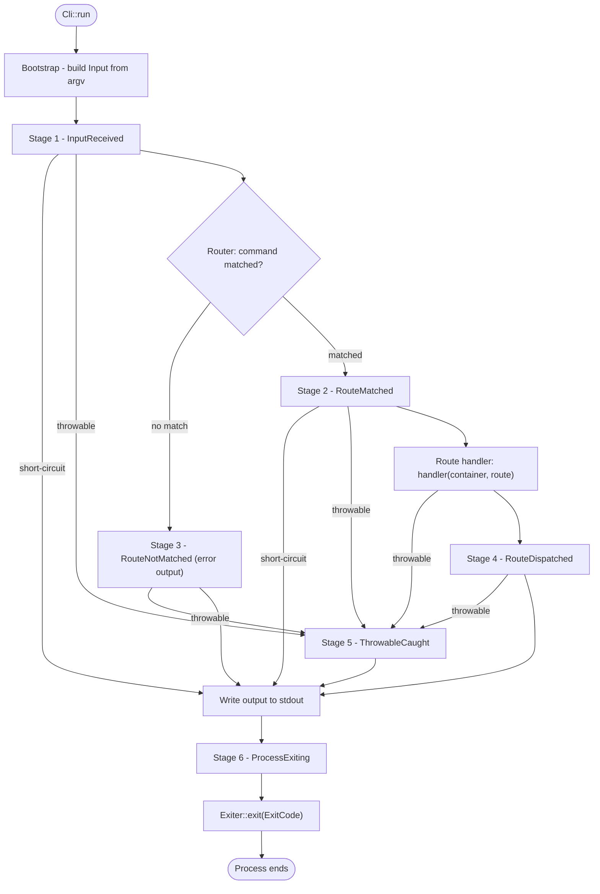

# CLI

The CLI component maps command-line input to command methods and writes the
result to the terminal. The component mirrors the structure of the HTTP
component, with three renamed concepts:

| HTTP             | CLI            |
| ---------------- | -------------- |
| `Request`        | `Input`        |
| `Response`       | `Output`       |
| `RequestHandler` | `InputHandler` |

## Configuration

`CliConfig` configures a CLI application. Two properties are CLI-specific:

- **`applicationName`** — the binary name shown in help and version output.
- **`defaultCommandName`** — the command that runs when the input names no
  command. The default is `list`.

```php
use Valkyrja\Application\Data\CliConfig;
use Valkyrja\Application\Entry\Cli;

Cli::run(new CliConfig(
    namespace:          'App',
    dir:                __DIR__,
    environment:        'production',
    debugMode:          false,
    timezone:           'UTC',
    key:                'your-application-key',
    applicationName:    'myapp',
    defaultCommandName: 'list',
));
```

The example spells out the arguments that an application commonly sets, and
some shown values equal the constructor defaults. Pass a named argument to set
a value, and omit the arguments you do not change. Convention: hold your
application's real values in the config object. Create one config file per
environment, or read the values from an env file in your own bootstrap. The
constructor defaults are generic placeholders.

Every constructor argument, with its default and what it does:

| Property                 | Default                                           | What it does                                                                       |
| ------------------------ | ------------------------------------------------- | ---------------------------------------------------------------------------------- |
| `namespace`              | `'App'`                                           | The application's root namespace                                                   |
| `dir`                    | `__DIR__`                                         | The application's root directory — set it explicitly                               |
| `version`                | framework version                                 | The application's version string                                                   |
| `environment`            | `'production'`                                    | The environment name                                                               |
| `debugMode`              | `false`                                           | Enables the Whoops throwable handler                                               |
| `timezone`               | `'UTC'`                                           | PHP's default timezone, set at boot                                                |
| `key`                    | `'some_secret_app_key'`                           | The application secret — always override this                                      |
| `dataPath`               | `'App/Provider/Data'`                             | Names the location of generated data classes; the framework does not read this     |
| `dataNamespace`          | `'App\\Provider\\Data'`                           | Names the namespace of generated data classes; the framework does not read this    |
| `applicationName`        | `'valkyrja'`                                      | The binary name shown in help and version output                                   |
| `defaultCommandName`     | `'list'`                                          | The command that runs when the input names no command                              |
| `providers`              | `[new CliWithHttpApplicationComponentProvider()]` | The `ComponentProviderContract` instances to boot                                  |
| `callbacks`              | `[]`                                              | Callables the application runs at boot, each `callable(ApplicationContract): void` |
| six `*Middleware` arrays | see [Global Middleware](#global-middleware)       | The global pipeline, one array per stage                                           |

Warning: the `providers` argument replaces the default list. When you pass
your own list, include a component provider that wires the CLI services. The
[Application README](../Application/README.md#configuration) covers the shared
properties in depth.

`CliConfig` is one way to start, not the only way. `Cli::run()` accepts any
`CliConfigContract`, so your own subclass of `CliConfig` works too. The
subclass can hold per-environment defaults.

### Renaming the Built-In Commands and Options

A custom config class is also how you rename the built-in commands and the
global options. `CliServerServiceProvider` checks the config against five
opt-in contracts in `Valkyrja\Cli\Server\Data\Contract`. When the config
implements a contract, the provider reads the names from its properties. When
it does not, the default names apply.

| Contract                             | Properties                                                          | Renames                                    |
| ------------------------------------ | ------------------------------------------------------------------- | ------------------------------------------ |
| `CliHelpCommandConfigContract`       | `helpCommandName`, `helpOptionName`, `helpOptionShortName`          | The `help` command and `--help`/`-h`       |
| `CliVersionCommandConfigContract`    | `versionCommandName`, `versionOptionName`, `versionOptionShortName` | The `version` command and `--version`/`-v` |
| `CliNoInteractionConfigContract`     | `noInteractionOptionName`, `noInteractionOptionShortName`           | `--no-interaction`/`-N`                    |
| `CliQuietInteractionConfigContract`  | `quietOptionName`, `quietOptionShortName`                           | `--quiet`/`-q`                             |
| `CliSilentInteractionConfigContract` | `silentOptionName`, `silentOptionShortName`                         | `--silent`/`-s`                            |

Implement only the contracts you need. Each property holds a name without the
leading dashes:

```php
use Valkyrja\Application\Data\CliConfig;
use Valkyrja\Cli\Server\Data\Contract\CliQuietInteractionConfigContract;

final class AppCliConfig extends CliConfig implements CliQuietInteractionConfigContract
{
    public string $quietOptionName = 'hush';

    public string $quietOptionShortName = 'H';
}
```

With this config, `--hush`/`-H` sets the quiet flag, and `--quiet`/`-q` no
longer does.

Warning: `helpCommandName` and `versionCommandName` only change where the
option middleware routes `--help` and `--version`. `HelpCommand` and
`VersionCommand` still register under `help` and `version` through their own
`#[Route]` attributes. When you set a new command name, also register a route
under that name. Without that route, the option routes to a command that does
not exist.

### Global Middleware

`CliConfig` holds one array per middleware stage: `inputReceivedMiddleware`,
`routeMatchedMiddleware`, `routeNotMatchedMiddleware`,
`routeDispatchedMiddleware`, `throwableCaughtMiddleware`, and
`processExitingMiddleware`. Middleware in these arrays runs on every
invocation. Three of the arrays ship with defaults:

| `CliConfig` array           | Default classes                                                                                                                                                                               |
| --------------------------- | --------------------------------------------------------------------------------------------------------------------------------------------------------------------------------------------- |
| `inputReceivedMiddleware`   | `CheckForHelpOptionsMiddleware` (`--help`/`-h`), `CheckForVersionOptionsMiddleware` (`--version`/`-v`), `CheckGlobalInteractionOptionsMiddleware` (`--quiet`, `--silent`, `--no-interaction`) |
| `routeNotMatchedMiddleware` | `CheckCommandForTypoMiddleware` (suggests a similar command name)                                                                                                                             |
| `throwableCaughtMiddleware` | `LogThrowableCaughtMiddleware`, `OutputThrowableCaughtMiddleware`                                                                                                                             |

The other three arrays default to empty. A passed array replaces the default,
so list the defaults you keep:

```php
use Valkyrja\Application\Data\CliConfig;
use Valkyrja\Cli\Server\Middleware\InputReceived\CheckForHelpOptionsMiddleware;
use Valkyrja\Cli\Server\Middleware\InputReceived\CheckForVersionOptionsMiddleware;
use Valkyrja\Cli\Server\Middleware\InputReceived\CheckGlobalInteractionOptionsMiddleware;

new CliConfig(
    // ...
    inputReceivedMiddleware: [
        CheckForHelpOptionsMiddleware::class,
        CheckForVersionOptionsMiddleware::class,
        CheckGlobalInteractionOptionsMiddleware::class,
        MaintenanceModeMiddleware::class,
    ],
);
```

See [Middleware](#middleware) for the stage contracts and worked examples.

### Interaction Config

`CliInteractionConfig` holds three output flags: `isInteractive` (default
`true`), `isQuiet` (default `false`), and `isSilent` (default `false`). The
`OutputFactory` copies the flags onto every output it creates, and the output
uses them when it writes (see
[Interactivity, Quiet, and Silent](#interactivity-quiet-and-silent)). The
`CheckGlobalInteractionOptionsMiddleware` mutates the config when the input
carries `--no-interaction`/`-N`, `--quiet`/`-q`, or `--silent`/`-s`, so every
command honors those global options without any code of its own.

## Entry Point

`Cli::run()` boots the application, parses `$_SERVER['argv']` into an `Input`
with `InputFactory::fromGlobals()`, resolves the `InputHandlerContract` from
the container, and calls `InputHandler::run()`. The handler runs the
middleware pipeline, writes the output messages, and calls `Exiter::exit()`
with the output's exit code.

`CliServerServiceProvider` publishes `InputHandler` under
`InputHandlerContract`, and that binding is the extension point. An
application that wants a different handler binds its own class to the same
contract in its own service provider. `Cli::run()` resolves the contract, so
it takes whatever the application bound.

```php
use Valkyrja\Cli\Routing\Dispatcher\Contract\RouterContract;
use Valkyrja\Cli\Server\Handler\Contract\InputHandlerContract;
use Valkyrja\Container\Manager\Contract\ContainerContract;
use Valkyrja\Container\Provider\Contract\ServiceProviderContract;

final class AppCliServerServiceProvider implements ServiceProviderContract
{
    public function publishers(): array
    {
        return [
            InputHandlerContract::class => [self::class, 'publishInputHandler'],
        ];
    }

    public static function publishInputHandler(ContainerContract $container): void
    {
        $container->setSingleton(
            InputHandlerContract::class,
            new AppInputHandler(
                container: $container,
                router: $container->getSingleton(RouterContract::class),
            )
        );
    }
}
```

`publishers()` maps the service id to the publisher, so a publisher that no
entry names never runs. Pass the dependencies the handler needs, because the
constructor defaults build an empty container and an empty route collection.

Every other contract this component publishes works the same way. The
framework ships one default for each, and the application replaces the ones
it needs.

A binary is one executable file that calls `Cli::run()`:

```php
#!/usr/bin/env php
<?php

use Valkyrja\Application\Data\CliConfig;
use Valkyrja\Application\Entry\Cli;

require __DIR__ . '/vendor/autoload.php';

Cli::run(new CliConfig(
    dir:             __DIR__,
    applicationName: 'myapp',
));
```

## Command-Line Syntax

`InputFactory::fromGlobals()` assigns each `argv` token one role:

- The first token is the **caller**. The caller is the binary name.
- The second token is the **command name**, when it is not an option token
  and not `--`. When the second token is an option or `--`, no token sets the
  command name, `defaultCommandName` applies, and every non-option token is
  an argument.
- Every later token that does not start with `-` is an **argument** value.
  Arguments bind to declared parameters by position.
- Every token that starts with `-` is an **option**, wherever it appears on
  the line.

Option tokens follow these rules:

- `--name=value` sets a long option value. The parser splits on the first `=`
  only, so `--filter=a=b` keeps the value `a=b`.
- `--name` with no `=` sets a long option with an empty value. An option with
  an empty value is a flag.
- `-n=value` sets a short option value. `-n` sets a short flag.
- `-abc` expands to the three short flags `-a -b -c`. A combined group cannot
  carry a value.
- `--` ends option parsing. Every later token is an argument, even one that
  starts with `-`. A later lone `-` is an argument by convention (it names
  standard input); at the second position it sets the command name.

```
php myapp user:greet Melech --shout -n=3 -- --literal-argument
```

The command is `user:greet`. The arguments are `Melech` and
`--literal-argument`. The options are `shout` (empty value) and `n` with the
value `3`.

## Routing

### Route Providers

A route provider implements `CliRouteProviderContract`. The contract declares
two instance methods. `getControllerClasses()` returns classes that carry
`#[Route]` attributes. This method is the common way, because the command
definition sits beside the command code. `getRoutes()` returns pre-built
`RouteContract` objects. Use `getRoutes()` for commands built at runtime, or
when you cannot annotate the class. One provider can use both. A provider that
uses only attributes returns an empty array from `getRoutes()`. The example
under [Pre-Built Routes](#pre-built-routes) shows both methods on one provider.

The CLI routing component registers the built-in commands through the same
contract. `CliRoutingComponentProvider::getCliProviders()` returns
`Valkyrja\Cli\Routing\Provider\CliRoutingCliRouteProvider`, which lists the
four built-in command classes and carries the four static handlers that their
`#[RouteHandler]` attributes name.

A component provider returns route providers from its `getCliProviders()`
method, and `CliConfig`'s `providers` array lists the component providers:

```php
use Valkyrja\Application\Kernel\Contract\ApplicationContract;
use Valkyrja\Application\Provider\Contract\ComponentProviderContract;

class AppComponentProvider implements ComponentProviderContract
{
    // The other ComponentProviderContract methods return empty arrays.

    public function getCliProviders(ApplicationContract $app): array
    {
        return [
            new AppCliRouteProvider(),
        ];
    }
}
```

At boot, the framework passes each controller class to the
`AttributeRouteCollector`, which reflects the class and converts its
`#[Route]` attributes into routes in the `RouteCollection`.

There is no compiled route file, and there is no separate matcher class. The
`Router` queries the `RouteCollection` by command name, and `CliRoutingData`
holds the collected routes in memory as closures.

### Pre-Built Routes

`getRoutes()` returns `Valkyrja\Cli\Routing\Data\Route` objects. The
constructor takes the same values as the `#[Route]` attribute, plus a required
`handler`. A handler on a pre-built route may be a closure; an attribute
cannot hold one, so attributed commands wire handlers with `#[RouteHandler]`
instead:

```php
use Valkyrja\Cli\Interaction\Message\NewLine;
use Valkyrja\Cli\Interaction\Message\SuccessMessage;
use Valkyrja\Cli\Interaction\Output\Contract\OutputContract;
use Valkyrja\Cli\Interaction\Output\Factory\Contract\OutputFactoryContract;
use Valkyrja\Cli\Routing\Data\ArgumentParameter;
use Valkyrja\Cli\Routing\Data\Contract\RouteContract;
use Valkyrja\Cli\Routing\Data\OptionParameter;
use Valkyrja\Cli\Routing\Data\Route;
use Valkyrja\Cli\Routing\Enum\ArgumentMode;
use Valkyrja\Cli\Routing\Provider\Contract\CliRouteProviderContract;
use Valkyrja\Container\Manager\Contract\ContainerContract;

class AppCliRouteProvider implements CliRouteProviderContract
{
    public function getControllerClasses(): array
    {
        return [
            GreetCommand::class,
            UserPurgeCommand::class,
        ];
    }

    public function getRoutes(): array
    {
        return [
            new Route(
                name:        'cache:clear',
                description: 'Clear the application cache',
                handler:     [self::class, 'cacheClearHandler'],
                arguments:   [
                    new ArgumentParameter(
                        name:        'store',
                        description: 'The cache store to clear',
                        mode:        ArgumentMode::OPTIONAL,
                    ),
                ],
                options:     [
                    new OptionParameter(
                        name:        'force',
                        description: 'Clear without confirmation',
                        shortNames:  ['f'],
                    ),
                ],
            ),
        ];
    }

    public static function cacheClearHandler(ContainerContract $container, RouteContract $route): OutputContract
    {
        $store = $route->getArgument('store')->getFirstValue();

        return $container->getSingleton(OutputFactoryContract::class)
            ->createOutput()
            ->withMessages(
                new SuccessMessage($store === '' ? 'Cache cleared.' : "Cache `$store` cleared."),
                new NewLine(),
            );
    }

    public static function greetHandler(ContainerContract $container, RouteContract $route): OutputContract
    {
        return $container->getSingleton(GreetCommand::class)->run();
    }

    public static function userPurgeHandler(ContainerContract $container, RouteContract $route): OutputContract
    {
        return $container->getSingleton(UserPurgeCommand::class)->run();
    }
}
```

`GreetCommand` and `UserPurgeCommand` are the attributed commands shown under
[Attribute Registration](#attribute-registration); each one's `#[RouteHandler]`
points back at a static handler on this provider.

### Attribute Registration

Annotate a controller method with `#[Route]` to register a command. The
attribute constructor takes:

| Parameter                                                                                                      | Purpose                                                          |
| -------------------------------------------------------------------------------------------------------------- | ---------------------------------------------------------------- |
| `name` (required)                                                                                              | The command name                                                 |
| `description` (required)                                                                                       | The one-line description shown by `list` and `help`              |
| `handler`                                                                                                      | The handler callable (usually set via `#[RouteHandler]` instead) |
| `helpText`                                                                                                     | An array callable that returns a `MessageContract`               |
| `routeMatchedMiddleware`, `routeDispatchedMiddleware`, `throwableCaughtMiddleware`, `processExitingMiddleware` | Per-route middleware class lists                                 |
| `arguments`                                                                                                    | `ArgumentParameterContract[]`                                    |
| `options`                                                                                                      | `OptionParameterContract[]`                                      |

The attribute is repeatable. Stack the attribute to serve several command
names from one method:

```php
use Valkyrja\Cli\Interaction\Output\Contract\OutputContract;
use Valkyrja\Cli\Routing\Attribute\Route;
use Valkyrja\Cli\Routing\Attribute\Route\RouteHandler;

class UserPurgeCommand
{
    #[Route(name: 'user:purge', description: 'Purge deleted users')]
    #[Route(name: 'user:prune', description: 'Purge deleted users')]
    #[RouteHandler([AppCliRouteProvider::class, 'userPurgeHandler'])]
    public function run(): OutputContract
    {
        // php myapp user:purge
        // php myapp user:prune
    }
}
```

A complete attributed command declares its parameters, wires its handler, and
reads its values from the matched route:

```php
use Valkyrja\Cli\Interaction\Message\Contract\MessageContract;
use Valkyrja\Cli\Interaction\Message\Message;
use Valkyrja\Cli\Interaction\Message\NewLine;
use Valkyrja\Cli\Interaction\Output\Contract\OutputContract;
use Valkyrja\Cli\Interaction\Output\Factory\Contract\OutputFactoryContract;
use Valkyrja\Cli\Routing\Attribute\ArgumentParameter;
use Valkyrja\Cli\Routing\Attribute\OptionParameter;
use Valkyrja\Cli\Routing\Attribute\Route;
use Valkyrja\Cli\Routing\Attribute\Route\RouteHandler;
use Valkyrja\Cli\Routing\Data\Contract\RouteContract;
use Valkyrja\Cli\Routing\Enum\ArgumentMode;

use function strtoupper;

class GreetCommand
{
    public function __construct(
        protected RouteContract $route,
        protected OutputFactoryContract $outputFactory,
    ) {
    }

    public static function help(): MessageContract
    {
        return new Message('A command to greet a user by name.');
    }

    #[Route(name: 'user:greet', description: 'Greet a user', helpText: [self::class, 'help'])]
    #[ArgumentParameter(name: 'name', description: 'The name to greet', mode: ArgumentMode::REQUIRED)]
    #[OptionParameter(name: 'shout', description: 'Greet in upper case', shortNames: ['S'])]
    #[RouteHandler([AppCliRouteProvider::class, 'greetHandler'])]
    public function run(): OutputContract
    {
        // php myapp user:greet Melech
        // php myapp user:greet Melech --shout
        $name     = $this->route->getArgument('name')->getFirstValue();
        $shout    = $this->route->getOption('shout')->hasFirstValue();
        $greeting = "Hello, $name!";

        return $this->outputFactory
            ->createOutput()
            ->withMessages(
                new Message($shout ? strtoupper($greeting) : $greeting),
                new NewLine(),
            );
    }
}
```

The command class receives the matched `RouteContract` through its
constructor, because the `Router` registers the route in the container before
the handler runs. Register the command class itself in the container through a
service provider, the same way the framework registers its built-in commands.
The abstract `Valkyrja\Cli\Routing\Controller\Controller` is an optional base
class whose constructor takes the `InputContract` and the
`OutputFactoryContract`.

### Route Handlers

Every route has a handler with this signature:

```php
callable(ContainerContract $container, RouteContract $route): OutputContract
```

The `Router` calls the handler with the container and the matched route after
the `RouteMatched` middleware has run. Wire the handler with the
`#[RouteHandler]` attribute, or pass `handler:` to `#[Route]` directly. PHP
attributes only accept constant expressions, so an attribute handler is always
an array callable. A closure only works on a pre-built route. The handler
resolves the command class from the container and calls it:

```php
use Valkyrja\Cli\Interaction\Output\Contract\OutputContract;
use Valkyrja\Cli\Routing\Data\Contract\RouteContract;
use Valkyrja\Container\Manager\Contract\ContainerContract;

public static function greetHandler(ContainerContract $container, RouteContract $route): OutputContract
{
    return $container->getSingleton(GreetCommand::class)->run();
}
```

The route carries the parsed argument and option values. Read them by
parameter name:

```php
$commandName = $route->getOption('command')->getFirstValue();
$appName     = $route->getArgument('applicationName')->getFirstValue();
```

`RouteContract::hasArgument()` and `hasOption()` report whether the route
**declares** a parameter with that name. These methods do not report whether
the invocation provided a value. The parameter's `hasFirstValue()` reports
whether a value arrived, so use `hasFirstValue()` to test for an optional
value or flag:

```php
$formatOption = $route->getOption('format');

$format = $formatOption->hasFirstValue()
    ? $formatOption->getFirstValue()
    : $formatOption->getDefaultValue();
```

### Command Name Grouping

The `#[Name]` attribute prepends or appends a segment to every `#[Route]` name
it accompanies, joined with a dot. On the class it prefixes each method's
route name; on a method it suffixes that method's route names. Use it to group
a controller's commands without repeating the group in every `#[Route]`:

```php
use Valkyrja\Cli\Routing\Attribute\Route;
use Valkyrja\Cli\Routing\Attribute\Route\Name;

#[Name('user')]
class UserCommands
{
    #[Route(name: 'greet', description: 'Greet a user')]
    public function greet(): OutputContract
    {
        // Registered as `user.greet`
    }
}
```

### Arguments

Arguments are positional values. Declare them as `ArgumentParameter` objects
in the `arguments` array of `#[Route]`, or as repeatable attributes on the
method. The constructor takes `name` and `description` (both required),
`cast`, `mode`, and `valueMode`:

| Enum                | Cases                  | Default    |
| ------------------- | ---------------------- | ---------- |
| `ArgumentMode`      | `REQUIRED`, `OPTIONAL` | `OPTIONAL` |
| `ArgumentValueMode` | `DEFAULT`, `ARRAY`     | `DEFAULT`  |

A `REQUIRED` argument must arrive. A `DEFAULT` argument takes at most one
value. The `Router` binds input values to argument parameters in declaration
order and validates each one; a violation throws
`CliRoutingArgumentValuesValidationException`, which the `ThrowableCaught`
stage turns into an error output.

```php
use Valkyrja\Cli\Routing\Attribute\ArgumentParameter;
use Valkyrja\Cli\Routing\Attribute\Route;
use Valkyrja\Cli\Routing\Enum\ArgumentMode;

#[Route(name: 'user:show', description: 'Show a user')]
#[ArgumentParameter(
    name:        'id',
    description: 'The user id',
    mode:        ArgumentMode::REQUIRED,
)]
public function run(): OutputContract
{
    // php myapp user:show 42       -> getFirstValue() === '42'
    // php myapp user:show          -> validation exception, error output
}
```

An `ARRAY` argument collects all remaining positional values, so it must be
the last declared argument:

```php
use Valkyrja\Cli\Routing\Attribute\ArgumentParameter;
use Valkyrja\Cli\Routing\Attribute\Route;
use Valkyrja\Cli\Routing\Enum\ArgumentMode;
use Valkyrja\Cli\Routing\Enum\ArgumentValueMode;

#[Route(name: 'files:process', description: 'Process files')]
#[ArgumentParameter(
    name:        'paths',
    description: 'The file paths to process',
    mode:        ArgumentMode::REQUIRED,
    valueMode:   ArgumentValueMode::ARRAY,
)]
public function run(): OutputContract
{
    // php myapp files:process a.txt b.txt c.txt
    foreach ($this->route->getArgument('paths')->getArguments() as $argument) {
        $path = $argument->getValue();
    }
}
```

### Options

Options are named flags. `OptionParameter` requires a `name` and a
`description`. The other constructor arguments:

| Argument           | Purpose                                                          |
| ------------------ | ---------------------------------------------------------------- |
| `valueDisplayName` | The value placeholder shown in help output (`--name=<display>`)  |
| `cast`             | A type cast for the values (see [Value Casting](#value-casting)) |
| `defaultValue`     | The fallback value (see below)                                   |
| `shortNames`       | An array of one-letter aliases                                   |
| `validValues`      | The allowed values; any other value fails validation             |
| `mode`             | `OptionMode::OPTIONAL` (default) or `REQUIRED`                   |
| `valueMode`        | `OptionValueMode::DEFAULT` (default), `NONE`, or `ARRAY`         |

| Enum              | Cases                      | Default    |
| ----------------- | -------------------------- | ---------- |
| `OptionMode`      | `REQUIRED`, `OPTIONAL`     | `OPTIONAL` |
| `OptionValueMode` | `NONE`, `DEFAULT`, `ARRAY` | `DEFAULT`  |

The `Router` matches each input option against the declared parameters by long
name or short name, then validates. A missing `REQUIRED` option, a repeated
`DEFAULT` option, and a value outside `validValues` throw
`CliRoutingOptionValuesValidationException`. A `NONE` option that receives a
value throws `CliRoutingInvalidOptionWithValueException`. An option that no
parameter declares binds to nothing; read it from the `InputContract` if you
need it.

A `DEFAULT` option takes one value:

```php
use Valkyrja\Cli\Routing\Attribute\OptionParameter;
use Valkyrja\Cli\Routing\Attribute\Route;

#[Route(name: 'user:export', description: 'Export users')]
#[OptionParameter(
    name:             'format',
    description:      'The export format',
    valueDisplayName: 'format',
    defaultValue:     'json',
    shortNames:       ['f'],
    validValues:      ['json', 'csv'],
)]
public function run(): OutputContract
{
    // php myapp user:export --format=csv
    // php myapp user:export -f=csv
    // php myapp user:export --format=xml   -> validation exception
    $formatOption = $this->route->getOption('format');

    $format = $formatOption->hasFirstValue()
        ? $formatOption->getFirstValue()
        : $formatOption->getDefaultValue();
}
```

`defaultValue` is informational: help output marks it among the valid values,
and `getDefaultValue()` returns it. The framework does not insert it into a
missing option, so apply the fallback yourself as shown.

A `NONE` option takes no value. This option is a pure flag. Test the option
with `hasFirstValue()`:

```php
use Valkyrja\Cli\Routing\Attribute\OptionParameter;
use Valkyrja\Cli\Routing\Attribute\Route;
use Valkyrja\Cli\Routing\Enum\OptionValueMode;

#[Route(name: 'db:migrate', description: 'Run database migrations')]
#[OptionParameter(
    name:        'dry-run',
    description: 'Preview without applying',
    shortNames:  ['d'],
    valueMode:   OptionValueMode::NONE,
)]
public function run(): OutputContract
{
    // php myapp db:migrate --dry-run
    // php myapp db:migrate -d
    $isDryRun = $this->route->getOption('dry-run')->hasFirstValue();
}
```

An `ARRAY` option accepts repeated flags and collects every value:

```php
use Valkyrja\Cli\Routing\Attribute\OptionParameter;
use Valkyrja\Cli\Routing\Attribute\Route;
use Valkyrja\Cli\Routing\Enum\OptionValueMode;

#[Route(name: 'app:deploy', description: 'Deploy the application')]
#[OptionParameter(
    name:        'tag',
    description: 'A tag to deploy',
    shortNames:  ['t'],
    valueMode:   OptionValueMode::ARRAY,
)]
public function run(): OutputContract
{
    // php myapp app:deploy --tag=web --tag=api -t=worker
    foreach ($this->route->getOption('tag')->getOptions() as $option) {
        $tag = $option->getValue();
    }
}
```

A `REQUIRED` option must arrive. The `Router` throws when the invocation omits
it:

```php
use Valkyrja\Cli\Routing\Attribute\OptionParameter;
use Valkyrja\Cli\Routing\Attribute\Route;
use Valkyrja\Cli\Routing\Enum\OptionMode;

#[Route(name: 'report:build', description: 'Build a report')]
#[OptionParameter(
    name:             'destination',
    description:      'The directory to write the report to',
    valueDisplayName: 'directory',
    mode:             OptionMode::REQUIRED,
)]
public function run(): OutputContract
{
    // php myapp report:build --destination=/tmp/reports
    // php myapp report:build   -> the router throws, because the option is missing
    $destination = $this->route->getOption('destination')->getFirstValue();
}
```

Reusable option parameters for the global options ship in
`Valkyrja\Cli\Routing\Data\Option`: `HelpOptionParameter`,
`VersionOptionParameter`, `QuietOptionParameter`, `SilentOptionParameter`, and
`NoInteractionOptionParameter`. Each is a pre-configured `OptionParameter`
you can add to a route's `options` array.

### Value Casting

Every parsed value is a string. Pass a `Cast` to a parameter to convert
values, then read them with `getCastValues()`:

```php
use Valkyrja\Cli\Routing\Attribute\ArgumentParameter;
use Valkyrja\Cli\Routing\Attribute\Route;
use Valkyrja\Cli\Routing\Enum\ArgumentMode;
use Valkyrja\Type\Data\Cast;
use Valkyrja\Type\Enum\CastType;

#[Route(name: 'queue:work', description: 'Work the queue')]
#[ArgumentParameter(
    name:        'workers',
    description: 'The worker count',
    cast:        new Cast(CastType::int),
    mode:        ArgumentMode::REQUIRED,
)]
public function run(): OutputContract
{
    // php myapp queue:work 4
    [$workers] = $this->route->getArgument('workers')->getCastValues(); // int(4)
}
```

`CastType` covers `string`, `int`, `float`, `bool`, `array`, `json`, and
more. With `new Cast(CastType::int, convert: false)` the cast values stay
wrapped in their `Valkyrja\Type` objects instead of converting to native
values. Without a cast, `getCastValues()` returns the raw strings.

### Help Text

`#[Route]` accepts a `helpText` callable that returns a `MessageContract`.
The callable must be an array callable. A closure throws
`CliRoutingInvalidHelpTextCallableException`, and an attribute cannot hold a
closure anyway. The `help` command renders the returned message:

```php
use Valkyrja\Cli\Interaction\Message\Contract\MessageContract;
use Valkyrja\Cli\Interaction\Message\Message;

public static function help(): MessageContract
{
    return new Message('A command to greet a user by name.');
}
```

```php
#[Route(name: 'user:greet', description: 'Greet a user', helpText: [self::class, 'help'])]
```

`php myapp help --command=user:greet` shows the help text together with the
command's declared arguments and options. The page shows each parameter's
description, mode, value display name, valid values, and default value.
`php myapp user:greet --help` shows the same page, because the
`CheckForHelpOptionsMiddleware` rewrites any input that carries `--help`/`-h`
into a `help` invocation for that command.

## Input and Output

### Input

`InputContract` is the parsed invocation. `getArguments()` returns
`ArgumentContract[]` in positional order. `getOption()` returns
`OptionContract[]`, because a flag can repeat:

```php
$name    = $input->getCaller();           // 'myapp'
$command = $input->getCommandName();      // 'user:create'
$args    = $input->getArguments();        // ArgumentContract[]
$formats = $input->getOption('format');   // OptionContract[]
$verbose = $input->hasOption('verbose');  // bool
```

An `ArgumentContract` carries `getValue()`. An `OptionContract` carries
`getName()`, `getValue()`, `hasValue()`, and `getType()`
(`OptionType::SHORT` or `LONG`). Prefer the route parameters in a command,
because the route parameters are validated and cast. Read the raw input for
undeclared options or for positional values outside the declared parameters.

The `InputHandler` registers the `InputContract` in the container, so any
service can receive it. The `Router` registers the matched `RouteContract`,
and the `InputHandler` registers the final `OutputContract` after dispatch.

### Output

A command method returns an `OutputContract`, which carries messages and an
exit code. Create one through the `OutputFactoryContract`:

```php
use Valkyrja\Cli\Interaction\Enum\ExitCode;
use Valkyrja\Cli\Interaction\Message\SuccessMessage;

return $this->outputFactory
    ->createOutput(exitCode: ExitCode::SUCCESS)
    ->withMessages(new SuccessMessage('Done.'));
```

| Output class   | Factory method         | Writes to                 |
| -------------- | ---------------------- | ------------------------- |
| `PlainOutput`  | `createPlainOutput()`  | stdout                    |
| `FileOutput`   | `createFileOutput()`   | a file                    |
| `StreamOutput` | `createStreamOutput()` | a PHP stream resource     |
| `EmptyOutput`  | `createEmptyOutput()`  | nowhere (discards output) |

`createOutput()` returns the base `Output`, which echoes each message's
formatted text to stdout. `PlainOutput` echoes the unformatted text. Every
factory method accepts an `ExitCode|int` and any number of messages, and
copies the interaction flags from the `CliInteractionConfig`.

`FileOutput` and `StreamOutput` write the same formatted text to a different
destination. `FileOutput` appends to the filepath, and it makes the file when
the file does not exist. `StreamOutput` writes to the stream resource at the
current position. A sequence of messages concatenates.

`FileOutput` never truncates. The file keeps the messages from each earlier
run, and the caller owns truncation. Delete the file before you construct the
output when a run must start from an empty file.

Warning: a factory-built `FileOutput` or `StreamOutput` copies the interaction
flags, so a flag suppresses a file write and a stream write, and not only a
terminal write (see
[Interactivity, Quiet, and Silent](#interactivity-quiet-and-silent)). Construct
the output directly when the destination must take the messages whatever the
flags say.

`StreamOutput` offers the remainder again while the stream takes part of the
data, because a non-blocking stream takes a large message over several calls.
A stream that takes no byte of an offer throws
`CliInteractionStreamWriteException`, which covers a stream that failed and a
stream whose buffer is full. A file write that stores less than the whole
message throws `CliInteractionFileWriteException`. Each throwable carries the
diagnostic of the failed write, when PHP records one.

`StreamOutput` throws `CliInteractionUnwritableStreamException` before it
writes, when the stream is closed, or when the stream mode carries no write
intent.

`InputHandler::run()` writes the messages after `handle()` returns, and it
routes a write throwable to the `ThrowableCaught` middleware. The recovery
output writes to stdout, so the process still reaches `Exiter::exit()`. The
recovery output copies the interaction flags from the `CliInteractionConfig`,
so a `--silent` run writes no recovery output. `getOutputFromThrowable()`
sets `ExitCode::ERROR` on that output, so the process reports `1` and not the
exit code the command set. `InputHandler::run()` replaces the output, so the
`ProcessExiting` middleware receives the recovery output.

A second failure takes the last resort. `InputHandler::run()` builds a plain
`Output` when `getOutputFromThrowable()` raises, when the `ThrowableCaught`
stage raises, or when the recovery write fails. That output carries the default
flags, so it writes both failures to stdout even on a `--silent` run, and no
configured factory can redirect it.

The `ProcessExiting` stage runs under a guard of its own. A middleware that
throws there writes the error banner to stdout, and the code the command set
still reaches `Exiter::exit()`.

An output is immutable: `withMessages()` replaces the unwritten messages,
`withAddedMessages()`/`withAddedMessage()` append, and `withExitCode()` sets
the exit code. The `InputHandler` calls `writeMessages()` after dispatch, so
a command only queues messages. To flush early, call `writeMessages()` and
keep the output that the call returns. The method writes on a copy, so the
output you called the method on still carries the messages, and the handler
writes those messages a second time.

### Messages

A message is text plus an optional formatter. The classes:

| Message class    | Purpose                                                 |
| ---------------- | ------------------------------------------------------- |
| `Message`        | Plain text, with an optional formatter                  |
| `SuccessMessage` | Success-styled text (white on green)                    |
| `ErrorMessage`   | Error-styled text (white on red)                        |
| `WarningMessage` | Warning-styled text (black on yellow)                   |
| `Banner`         | A padded block around a message, in the message's style |
| `NewLine`        | A line break                                            |
| `Messages`       | A composite that concatenates other messages            |
| `Header`         | The application info header the built-in commands print |
| `Question`       | An interactive prompt (see [Questions](#questions))     |
| `Progress`       | A message with a percentage and a completion flag       |

Messages carry no line breaks of their own. Compose with `NewLine`:

```php
use Valkyrja\Cli\Interaction\Message\Banner;
use Valkyrja\Cli\Interaction\Message\ErrorMessage;
use Valkyrja\Cli\Interaction\Message\Message;
use Valkyrja\Cli\Interaction\Message\NewLine;

$output = $output->withAddedMessages(
    new Banner(new ErrorMessage('Deployment failed.')),
    new NewLine(),
    new Message('Check the log for details.'),
    new NewLine(),
);
```

### Formatters

A `Formatter` wraps text in ANSI escape codes built from `Format` objects:
`TextColorFormat` (a `TextColor` case), `BackgroundColorFormat` (a
`BackgroundColor` case), and `StyleFormat` (a `Style` case — `BOLD`,
`UNDERSCORE`, `BLINK`, `INVERSE`, `CONCEAL`). Both color enums offer the
eight base colors, `DARK_GRAY`, and `LIGHT_RED` through `LIGHT_WHITE`. There
is no `LIGHT_BLACK` case:

```php
use Valkyrja\Cli\Interaction\Enum\Style;
use Valkyrja\Cli\Interaction\Enum\TextColor;
use Valkyrja\Cli\Interaction\Format\StyleFormat;
use Valkyrja\Cli\Interaction\Format\TextColorFormat;
use Valkyrja\Cli\Interaction\Formatter\Formatter;
use Valkyrja\Cli\Interaction\Message\Message;

$message = new Message(
    'Heads up!',
    new Formatter(
        new TextColorFormat(TextColor::CYAN),
        new StyleFormat(Style::BOLD),
    ),
);
```

Ready-made formatters: `SuccessFormatter`, `ErrorFormatter`,
`WarningFormatter`, `HighlightedTextFormatter` (yellow text), and
`QuestionFormatter` (magenta text). Extend `Formatter` the same way to define
your own house style.

### Questions

A `Question` is a message that prompts the user and reads a line from stdin
when the output writes it. It pairs with an `Answer`, which holds the default
response, the allowed responses, and an optional validation callable. The
question's callable receives the output and the final answer, and returns the
output to continue with:

```php
use Valkyrja\Cli\Interaction\Message\Answer;
use Valkyrja\Cli\Interaction\Message\Contract\AnswerContract;
use Valkyrja\Cli\Interaction\Message\NewLine;
use Valkyrja\Cli\Interaction\Message\Question;
use Valkyrja\Cli\Interaction\Message\SuccessMessage;
use Valkyrja\Cli\Interaction\Output\Contract\OutputContract;

$question = new Question(
    'Drop all tables?',
    static function (OutputContract $output, AnswerContract $answer): OutputContract {
        if ($answer->getUserResponse() !== 'yes') {
            return $output;
        }

        return $output->withAddedMessages(
            new SuccessMessage('Tables dropped.'),
            new NewLine(),
        );
    },
    new Answer(defaultResponse: 'no', allowedResponses: ['yes', 'no']),
);

return $this->outputFactory
    ->createOutput()
    ->withMessages($question);
```

The rendered prompt lists the allowed responses and the default. A new
`Answer` starts with the default response as its user response. An empty
response leaves the supplied answer unchanged, so the default response
stands. A response outside the allowed list re-asks the question, unless
the validation callable accepts it. A non-interactive, quiet, or silent
output does not read from stdin. The supplied answer applies, so a
scripted run never blocks.

`ask()` returns the supplied answer unchanged when the stdin stream
does not open. `ask()` returns the answer unchanged when a read from the
stream reaches the end of input or fails. `ask()` sets the answered flag
only when a non-empty response arrives. When the answer holds an allowed
response, a run whose stdin is closed or empty behaves the same as
`--no-interaction`. The question then never makes the run fail.

The default `QuestionWriter` on every output drives this flow. `getWriters()`
and `withWriters()` expose the writer list; a custom `WriterContract` can
intercept any message type the same way.

### Interactivity, Quiet, and Silent

Every output carries three flags, read from `CliInteractionConfig` at
creation: `isInteractive()`, `isQuiet()`, and `isSilent()`. A silent output
writes nothing. A quiet output writes nothing while the exit code is identical
to `ExitCode::SUCCESS`, so an output that holds an error code still prints, and
so does one that holds the integer `0`. A non-interactive output skips question
prompts. The global options `--no-interaction`/`-N`, `--quiet`/`-q`, and
`--silent`/`-s` set the flags for any command. `withIsInteractive()`,
`withIsQuiet()`, and `withIsSilent()` override them per output.

### Exit Codes

`ExitCode` mirrors most of the BSD sysexits codes. Two cases deviate:
`sysexits.h` assigns 66 to a missing input and 67 to an unknown user, while
`ExitCode` assigns 67 and 68. `InputHandler::run()` passes the code's integer
value to `Exiter::exit()` after the `ProcessExiting` middleware runs:

| Case             | Value | Meaning                           |
| ---------------- | ----- | --------------------------------- |
| `SUCCESS`        | 0     | Normal exit                       |
| `ERROR`          | 1     | Generic error                     |
| `USAGE_ERROR`    | 64    | Command used incorrectly          |
| `DATA_ERROR`     | 65    | Bad input data                    |
| `NO_INPUT`       | 67    | Input not found                   |
| `NO_USER`        | 68    | User does not exist               |
| `UNAVAILABLE`    | 69    | Service unavailable               |
| `SOFTWARE_ERROR` | 70    | Internal software error           |
| `OS_ERROR`       | 71    | Operating system error            |
| `OS_FILE_ERROR`  | 72    | OS file error                     |
| `CANT_CREATE`    | 73    | Cannot create output file         |
| `IO_ERROR`       | 74    | I/O error                         |
| `TEMP_FAIL`      | 75    | Temporary failure, user may retry |
| `PROTOCOL_ERROR` | 76    | Remote error in protocol          |
| `NO_PERMISSION`  | 77    | Permission denied                 |
| `CONFIG_ERROR`   | 78    | Configuration error               |
| `AUTO_EXIT`      | 255   | Reserved                          |

`withExitCode()` also accepts a plain `int` for codes outside the enum. In a
test, `Exiter::freeze()` makes `Exiter::exit()` echo the code instead of
terminating the process; `Exiter::unfreeze()` restores it.

## Middleware

Each stage has a contract, and a middleware class implements the contracts
that apply to it. A middleware either forwards the call through the handler
chain or short-circuits with an `OutputContract`. The stage handlers resolve
each middleware class from the container, so register your middleware through
a service provider, the same as a command class.

### InputReceived

`InputReceivedMiddlewareContract` fires before route matching. The middleware
returns an `InputContract` to continue, or an `OutputContract` to
short-circuit. The middleware can rewrite the `InputContract`, as the
built-in help and version middleware do:

```php
use Valkyrja\Cli\Interaction\Enum\ExitCode;
use Valkyrja\Cli\Interaction\Input\Contract\InputContract;
use Valkyrja\Cli\Interaction\Message\ErrorMessage;
use Valkyrja\Cli\Interaction\Output\Contract\OutputContract;
use Valkyrja\Cli\Interaction\Output\Factory\Contract\OutputFactoryContract;
use Valkyrja\Cli\Middleware\Contract\InputReceivedMiddlewareContract;
use Valkyrja\Cli\Middleware\Handler\Contract\InputReceivedHandlerContract;

class MaintenanceModeMiddleware implements InputReceivedMiddlewareContract
{
    public function __construct(
        protected OutputFactoryContract $outputFactory,
        protected bool $isDown = false,
    ) {
    }

    public function inputReceived(
        InputContract $input,
        InputReceivedHandlerContract $handler
    ): InputContract|OutputContract {
        if ($this->isDown) {
            return $this->outputFactory
                ->createOutput(exitCode: ExitCode::UNAVAILABLE)
                ->withMessages(new ErrorMessage('The application is down.'));
        }

        return $handler->inputReceived($input);
    }
}
```

### RouteMatched

`RouteMatchedMiddlewareContract` fires after a command matches and before its
handler runs. The middleware returns the `RouteContract` to continue, or an
`OutputContract` to short-circuit. The middleware can modify the
`RouteContract`:

```php
use Valkyrja\Cli\Interaction\Enum\ExitCode;
use Valkyrja\Cli\Interaction\Input\Contract\InputContract;
use Valkyrja\Cli\Interaction\Message\ErrorMessage;
use Valkyrja\Cli\Interaction\Output\Contract\OutputContract;
use Valkyrja\Cli\Interaction\Output\Factory\Contract\OutputFactoryContract;
use Valkyrja\Cli\Middleware\Contract\RouteMatchedMiddlewareContract;
use Valkyrja\Cli\Middleware\Handler\Contract\RouteMatchedHandlerContract;
use Valkyrja\Cli\Routing\Data\Contract\RouteContract;

use function str_starts_with;

class ProductionGuardMiddleware implements RouteMatchedMiddlewareContract
{
    public function __construct(
        protected OutputFactoryContract $outputFactory,
        protected bool $isProduction = false,
    ) {
    }

    public function routeMatched(
        InputContract $input,
        RouteContract $route,
        RouteMatchedHandlerContract $handler
    ): RouteContract|OutputContract {
        if ($this->isProduction && str_starts_with($route->getName(), 'db:')) {
            return $this->outputFactory
                ->createOutput(exitCode: ExitCode::NO_PERMISSION)
                ->withMessages(new ErrorMessage('This command cannot run in production.'));
        }

        return $handler->routeMatched($input, $route);
    }
}
```

### RouteNotMatched

`RouteNotMatchedMiddlewareContract` fires when no command matches. It
receives the router's error output and returns the output to write:

```php
use Valkyrja\Cli\Interaction\Input\Contract\InputContract;
use Valkyrja\Cli\Interaction\Message\Message;
use Valkyrja\Cli\Interaction\Message\NewLine;
use Valkyrja\Cli\Interaction\Output\Contract\OutputContract;
use Valkyrja\Cli\Middleware\Contract\RouteNotMatchedMiddlewareContract;
use Valkyrja\Cli\Middleware\Handler\Contract\RouteNotMatchedHandlerContract;

class SuggestListMiddleware implements RouteNotMatchedMiddlewareContract
{
    public function routeNotMatched(
        InputContract $input,
        OutputContract $output,
        RouteNotMatchedHandlerContract $handler
    ): OutputContract {
        $output = $output->withAddedMessages(
            new NewLine(),
            new Message('Run `myapp list` to see every command.'),
            new NewLine(),
        );

        return $handler->routeNotMatched($input, $output);
    }
}
```

### RouteDispatched

`RouteDispatchedMiddlewareContract` fires after the handler produced an
output. Use it for auditing or output transformation:

```php
use Valkyrja\Cli\Interaction\Input\Contract\InputContract;
use Valkyrja\Cli\Interaction\Output\Contract\OutputContract;
use Valkyrja\Cli\Middleware\Contract\RouteDispatchedMiddlewareContract;
use Valkyrja\Cli\Middleware\Handler\Contract\RouteDispatchedHandlerContract;
use Valkyrja\Cli\Routing\Data\Contract\RouteContract;
use Valkyrja\Log\Logger\Contract\LoggerContract;

class CommandAuditMiddleware implements RouteDispatchedMiddlewareContract
{
    public function __construct(
        protected LoggerContract $logger,
    ) {
    }

    public function routeDispatched(
        InputContract $input,
        OutputContract $output,
        RouteContract $route,
        RouteDispatchedHandlerContract $handler
    ): OutputContract {
        $this->logger->info('Command ran: ' . $route->getName());

        return $handler->routeDispatched($input, $output, $route);
    }
}
```

### ThrowableCaught

`ThrowableCaughtMiddlewareContract` fires when a throwable escapes any part
of dispatch, and it fires when the output write throws.

The write runs after `handle()` returns, so the stage sees a throwable that no
command raised. A middleware that reads the throwable receives
`CliInteractionFileWriteException`, `CliInteractionStreamWriteException`, and
`CliInteractionUnwritableStreamException` as well.

A middleware of this stage can itself throw. `handle()` then builds an output
that names the command's throwable and the middleware's, and the caller still
receives an output.

Warning: the run in `run()` resumes the chain rather than restarting it.
`Handler` advances its index once for each middleware it resolves and never
rewinds it, and `CliMiddlewareServiceProvider` publishes one handler as a
singleton. A command that throws makes `handle()` run the stage first, so a
first run that reached the end of the chain leaves no middleware for the one
in `run()`.

`ThrowableCaughtMiddlewareContract` receives a default error output and the
throwable, and returns the output to write:

```php
use Throwable;
use Valkyrja\Cli\Interaction\Input\Contract\InputContract;
use Valkyrja\Cli\Interaction\Message\Message;
use Valkyrja\Cli\Interaction\Message\NewLine;
use Valkyrja\Cli\Interaction\Output\Contract\OutputContract;
use Valkyrja\Cli\Middleware\Contract\ThrowableCaughtMiddlewareContract;
use Valkyrja\Cli\Middleware\Handler\Contract\ThrowableCaughtHandlerContract;

class UsageHintMiddleware implements ThrowableCaughtMiddlewareContract
{
    public function throwableCaught(
        InputContract $input,
        OutputContract $output,
        Throwable $throwable,
        ThrowableCaughtHandlerContract $handler
    ): OutputContract {
        $output = $output->withAddedMessages(
            new NewLine(),
            new Message('Run the command again with `--help` for usage.'),
            new NewLine(),
        );

        return $handler->throwableCaught($input, $output, $throwable);
    }
}
```

If no `ThrowableCaught` middleware changes the output, the `InputHandler`
falls back to a default error banner with the command name and the exception
message.

### ProcessExiting

`ProcessExitingMiddlewareContract` fires after the output is written and
before the process exits. The middleware returns nothing, because the output
is already on the terminal. Use this stage for deferred cleanup:

```php
use Valkyrja\Cli\Interaction\Input\Contract\InputContract;
use Valkyrja\Cli\Interaction\Output\Contract\OutputContract;
use Valkyrja\Cli\Middleware\Contract\ProcessExitingMiddlewareContract;
use Valkyrja\Cli\Middleware\Handler\Contract\ProcessExitingHandlerContract;
use Valkyrja\Log\Logger\Contract\LoggerContract;

class FlushLogsMiddleware implements ProcessExitingMiddlewareContract
{
    public function __construct(
        protected LoggerContract $logger,
    ) {
    }

    public function processExiting(
        InputContract $input,
        OutputContract $output,
        ProcessExitingHandlerContract $handler
    ): void {
        $this->logger->info('Process exiting.');

        $handler->processExiting($input, $output);
    }
}
```

### Registering Middleware

Every stage accepts global middleware through its `CliConfig` array (see
[Global Middleware](#global-middleware)). Four stages also accept per-route
middleware through the matching `#[Route]` parameter, or through the
repeatable `#[Middleware]` attribute, which sorts each class into every stage
whose contract it implements:

```php
use Valkyrja\Cli\Routing\Attribute\Route;
use Valkyrja\Cli\Routing\Attribute\Route\Middleware;

#[Route(
    name:                   'db:migrate',
    description:            'Run database migrations',
    routeMatchedMiddleware: [ProductionGuardMiddleware::class],
)]
#[Middleware(CommandAuditMiddleware::class)]
public function run(): OutputContract
{
    // ...
}
```

| Stage             | Contract                            | When it fires                                | Per-route |
| ----------------- | ----------------------------------- | -------------------------------------------- | --------- |
| `InputReceived`   | `InputReceivedMiddlewareContract`   | Before route matching                        | No        |
| `RouteMatched`    | `RouteMatchedMiddlewareContract`    | After match, before dispatch                 | Yes       |
| `RouteNotMatched` | `RouteNotMatchedMiddlewareContract` | When no command matches                      | No        |
| `RouteDispatched` | `RouteDispatchedMiddlewareContract` | After dispatch                               | Yes       |
| `ThrowableCaught` | `ThrowableCaughtMiddlewareContract` | When a throwable is caught                   | Yes       |
| `ProcessExiting`  | `ProcessExitingMiddlewareContract`  | After output is written, before process exit | Yes       |

## Built-In Commands

| Command     | Description                                           |
| ----------- | ----------------------------------------------------- |
| `list`      | Lists all registered commands with their descriptions |
| `list:bash` | Outputs a bash-completion-compatible command list     |
| `help`      | Displays help text for a given command                |
| `version`   | Displays the application version                      |
| `http:list` | Lists all registered HTTP routes (HTTP component)     |

```
php myapp list                      # every command
php myapp list -n=user              # only the `user:` namespace (--namespace)
php myapp help --command=list       # help for one command
php myapp list --help               # the same help page
php myapp version                   # the version number
php myapp list:bash myapp           # command names for bash completion
```

The HTTP routing component registers `http:list` through its own provider,
`Valkyrja\Http\Routing\Provider\HttpRoutingCliRouteProvider`.

The global options work on every command. The `InputReceived` defaults handle
the first two; the interaction options set the output flags:

| Option             | Short | Effect                                   |
| ------------------ | ----- | ---------------------------------------- |
| `--help`           | `-h`  | Shows the command's help page            |
| `--version`        | `-v`  | Shows the application version            |
| `--quiet`          | `-q`  | Suppresses output unless an error occurs |
| `--silent`         | `-s`  | Suppresses all output                    |
| `--no-interaction` | `-N`  | Answers every question with its default  |

## Lifecycle

1. `Cli::run()` boots the application, and the route providers fill the
   `RouteCollection`.
2. `InputFactory::fromGlobals()` parses `$_SERVER['argv']` into an
   `InputContract`, and `InputHandler::run()` receives it.
3. The `InputReceived` middleware runs. An output short-circuits to step 9.
4. The `Router` matches the command name against the collection. On no match,
   the `RouteNotMatched` middleware runs on an error output, and the flow
   continues at step 9.
5. The `Router` binds the input's arguments and options into the route's
   declared parameters and validates them.
6. The matched route registers in the container, and the `RouteMatched`
   middleware runs. An output short-circuits to step 9.
7. The route handler runs as `$handler($container, $route)`. Then the
   `RouteDispatched` middleware runs on the handler's output.
8. A throwable from steps 3 through 7 lands in the `ThrowableCaught`
   middleware, which produces the error output. Boot, argv parsing, and the
   steps below all run outside that guard.
9. The output's messages write to the terminal.
10. The `ProcessExiting` middleware runs, and `Exiter::exit()` ends the
    process with the output's exit code.


