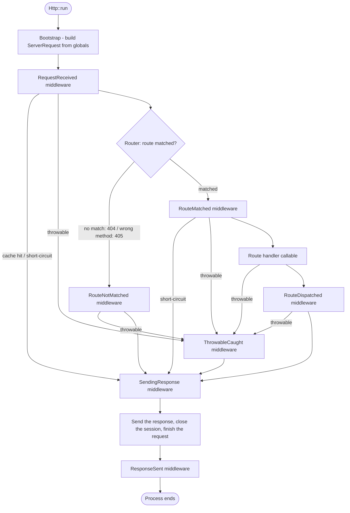

# HTTP

The HTTP component matches an incoming request to a handler and runs middleware
around every phase of the dispatch. The request and response classes follow the
shape of PSR-7, but they do not implement the `Psr\Http\Message\*` interfaces.
The middleware pipeline is Valkyrja's own; the component does not use PSR-15
internally. The [PSR compatibility](#psr-compatibility) section lists the
bridges to code that expects the PSR interfaces.

The component has six parts:

- **`Http\Message`** — the request, response, URI, stream, header, and file
  classes.
- **`Http\Routing`** — the route attributes, the collector, the matcher, and
  the URL generator.
- **`Http\Middleware`** — the seven stage contracts and their handlers.
- **`Http\Server`** — the request handler, the entry point services, and the
  built-in middleware.
- **`Http\Struct`** — enum-based request validation and response shaping.
- **`Http\Client`** — an outbound HTTP client behind one contract.

## Configuration and entry point

The `HttpConfig` class holds the core configuration as constructor arguments,
and every argument has a default. Two features read extra config contracts
that an `HttpConfig` subclass implements: the cache directory for
[response caching](#response-caching) and the default
[HTTP client](#the-http-client). `Http::run()` is the entry point:

```php
// public/index.php
use Valkyrja\Application\Data\HttpConfig;
use Valkyrja\Application\Entry\Http;

Http::run(new HttpConfig(
    namespace:   'App',
    dir:         __DIR__,
    environment: 'production',
    debugMode:   false,
    timezone:    'UTC',
    key:         'your-application-key',
));
```

The example spells out the arguments that an application commonly sets, and
some shown values equal the constructor defaults. Pass a named argument to set
a value, and omit the arguments you do not change. Convention: hold your
application's real values in the config object. Create one config file per
environment, or read the values from an env file in your own bootstrap. The
constructor defaults are generic placeholders.

Every constructor argument, with its default and what it does:

| Property                   | Default                                    | What it does                                                                                                                       |
| -------------------------- | ------------------------------------------ | ---------------------------------------------------------------------------------------------------------------------------------- |
| `namespace`                | `'App'`                                    | The application's root namespace                                                                                                   |
| `dir`                      | `__DIR__`                                  | The application's root directory — set it explicitly                                                                               |
| `version`                  | framework version                          | The application's version string                                                                                                   |
| `environment`              | `'production'`                             | The environment name                                                                                                               |
| `debugMode`                | `false`                                    | Enables the Whoops handler and fresh route collection (see [debug mode](#the-route-collection-and-debug-mode))                     |
| `timezone`                 | `'UTC'`                                    | PHP's default timezone, set at boot                                                                                                |
| `key`                      | `'some_secret_app_key'`                    | The application secret — always override this                                                                                      |
| `dataPath`                 | `'App/Provider/Data'`                      | Names the location of generated data classes; the framework does not read this property                                            |
| `dataNamespace`            | `'App\\Provider\\Data'`                    | Names the namespace of generated data classes; the framework does not read this property                                           |
| `providers`                | `[new HttpApplicationComponentProvider()]` | The `ComponentProviderContract` instances to boot                                                                                  |
| `callbacks`                | `[]`                                       | Callables the application runs at boot, each `callable(ApplicationContract): void`                                                 |
| seven `*Middleware` arrays | `[]`, except the two stages with built-ins | The global pipeline, one array per stage — the defaults are in [registering middleware globally](#registering-middleware-globally) |

Warning: the `providers` argument replaces the default list. When you pass
your own list, include `HttpApplicationComponentProvider` in it. The
[Application README](../Application/README.md#configuration) covers the shared
properties in depth, and its
[Your Own Config Class](../Application/README.md#your-own-config-class)
section covers the custom config class. The built-in `HttpConfig` is one way
to start, not the only way — `Http::run()` accepts any `HttpConfigContract`.

`Http::run()` boots the application, builds a `ServerRequest` from the
superglobals with `RequestFactory::fromGlobals()`, resolves the
`RequestHandlerContract` from the container, and runs the request through it.

## Routing

### Route providers

A route provider implements `HttpRouteProviderContract`. It returns a list of
controller classes to reflect on, a list of pre-built route objects, or both:

```php
use Override;
use Valkyrja\Http\Routing\Provider\Contract\HttpRouteProviderContract;

class UserRouteProvider implements HttpRouteProviderContract
{
    #[Override]
    public function getControllerClasses(): array
    {
        return [UserController::class];
    }

    #[Override]
    public function getRoutes(): array
    {
        return [];
    }
}
```

The `AttributeRouteCollector` reflects on each controller class and collects the
routes that its `#[Route]` attributes declare. The `Processor` prepares each
pre-built route from `getRoutes()`. Choose by how the route is written:

- **`getControllerClasses()`** — the route lives as an attribute on the
  controller method. This is the common path for application controllers,
  because the route and the code it serves sit together.
- **`getRoutes()`** — the route is built in code as a data object. Use this
  when a route has no controller class, or when another system generates the
  routes.

A component provider returns the route providers from its `getHttpProviders()`
method:

```php
use Override;
use Valkyrja\Application\Kernel\Contract\ApplicationContract;
use Valkyrja\Application\Provider\Contract\ComponentProviderContract;

class AppComponentProvider implements ComponentProviderContract
{
    #[Override]
    public function getComponentProviders(ApplicationContract $app): array
    {
        return [];
    }

    #[Override]
    public function getContainerProviders(ApplicationContract $app): array
    {
        return [new UserServiceProvider()];
    }

    #[Override]
    public function getEventProviders(ApplicationContract $app): array
    {
        return [];
    }

    #[Override]
    public function getCliProviders(ApplicationContract $app): array
    {
        return [];
    }

    #[Override]
    public function getHttpProviders(ApplicationContract $app): array
    {
        return [new UserRouteProvider()];
    }
}
```

The `getContainerProviders()` method returns the service providers that bind
the controllers and the middleware in the container.
[Pre-built routes](#pre-built-routes-from-getroutes) defines
`UserServiceProvider`. The `providers` array of `HttpConfig` lists the
component provider:

```php
use Valkyrja\Application\Data\HttpConfig;
use Valkyrja\Application\Provider\HttpApplicationComponentProvider;

$config = new HttpConfig(
    providers: [
        new HttpApplicationComponentProvider(),
        new AppComponentProvider(),
    ],
);
```

### Pre-built routes from getRoutes()

A static route is a `Route` data object. A dynamic route is a `DynamicRoute`
data object with `Parameter` data objects. Pass `regex: ''` — the `Processor`
builds the full match regex from the path and the parameters:

```php
use Override;
use Valkyrja\Container\Manager\Contract\ContainerContract;
use Valkyrja\Http\Message\Response\Contract\ResponseContract;
use Valkyrja\Http\Routing\Constant\Regex;
use Valkyrja\Http\Routing\Data\Contract\DynamicRouteContract;
use Valkyrja\Http\Routing\Data\Contract\RouteContract;
use Valkyrja\Http\Routing\Data\DynamicRoute;
use Valkyrja\Http\Routing\Data\Parameter;
use Valkyrja\Http\Routing\Data\Route;
use Valkyrja\Http\Routing\Provider\Contract\HttpRouteProviderContract;

class UserRouteProvider implements HttpRouteProviderContract
{
    #[Override]
    public function getControllerClasses(): array
    {
        return [];
    }

    #[Override]
    public function getRoutes(): array
    {
        return [
            new Route(
                path: '/users',
                name: 'users.index',
                handler: [self::class, 'indexHandler'],
            ),
            new DynamicRoute(
                path: '/users/{id}',
                name: 'users.show',
                regex: '',
                parameters: [new Parameter(name: 'id', regex: Regex::ID)],
                handler: [self::class, 'showHandler'],
            ),
        ];
    }

    public static function indexHandler(ContainerContract $container, RouteContract $route): ResponseContract
    {
        return $container->get(UserController::class)->index();
    }

    public static function showHandler(ContainerContract $container, RouteContract $route): ResponseContract
    {
        /** @var DynamicRouteContract $route */
        $id = (int) $route->getParameter('id')->getValue();

        return $container->get(UserController::class)->show($id);
    }
}
```

The handlers resolve `UserController` with `ContainerContract::get()`, and
`get()` throws `ContainerInvalidReferenceException` for an id that no binding
resolves. A service provider binds the controller:

```php
use Valkyrja\Container\Manager\Contract\ContainerContract;
use Valkyrja\Container\Provider\Contract\ServiceProviderContract;

class UserServiceProvider implements ServiceProviderContract
{
    public function publishers(): array
    {
        return [
            UserController::class => [self::class, 'publishUserController'],
        ];
    }

    public static function publishUserController(ContainerContract $container): void
    {
        $container->setSingleton(
            UserController::class,
            new UserController()
        );
    }
}
```

Return the provider from `getContainerProviders()` in the
[component provider](#route-providers). The
[Container README](../Container/README.md#service-providers) covers the
service provider pattern in depth.

Both constructors take the same optional arguments as the `#[Route]`
attribute: `requestMethods`, the five per-route middleware arrays,
`requestStruct`, and `responseStruct`.

### Attribute routes

Declare a route with the `#[Route]` attribute on a controller method. The
attribute is repeatable, and the default request methods are `HEAD` and `GET`:

```php
use Valkyrja\Http\Message\Enum\RequestMethod;
use Valkyrja\Http\Message\Enum\StatusCode;
use Valkyrja\Http\Message\Response\Contract\ResponseContract;
use Valkyrja\Http\Message\Response\JsonResponse;
use Valkyrja\Http\Routing\Attribute\Route;
use Valkyrja\Http\Routing\Attribute\Route\RouteHandler;

class UserController
{
    #[Route(path: '/users', name: 'users.index')]
    #[RouteHandler([UserRouteProvider::class, 'indexHandler'])]
    public function index(): ResponseContract
    {
        return new JsonResponse(['users' => []]);
    }

    #[Route(path: '/users', name: 'users.store', requestMethods: [RequestMethod::POST])]
    #[RouteHandler([UserRouteProvider::class, 'storeHandler'])]
    public function store(): ResponseContract
    {
        return new JsonResponse([], StatusCode::CREATED);
    }
}
```

The attribute declares the route. It does not make the framework call the
routed method — the route's [handler](#route-handlers) does that, and a route
without a handler returns an empty `Response`. Wire the handler with
`#[RouteHandler]`, as every routed method in this README does. The named
handlers follow the `indexHandler` and `showHandler` pattern from
[pre-built routes](#pre-built-routes-from-getroutes). A handler reads the
matched values from the route and calls the routed method with them.

Stack the attribute to serve several paths from one method. Each attribute
declares its own route with its own name:

```php
#[Route(path: '/', name: 'home')]
#[Route(path: '/welcome', name: 'welcome')]
#[RouteHandler([HomeRouteProvider::class, 'homeHandler'])]
public function home(): ResponseContract
{
    return new JsonResponse(['message' => 'Welcome']);
}
```

Every other attribute on the method applies to all routes that the method
declares. Give a route its own configuration through that route's own
arguments.

### Route handlers

Every route has a handler with the signature
`callable(ContainerContract $container, RouteContract $route): ResponseContract`.
The handler resolves the controller with `ContainerContract::get()` and calls
it. `get()` returns the registered service, and it throws
`ContainerInvalidReferenceException` when nothing registered the id, so every
controller that a handler resolves needs a service registration.
[Pre-built routes](#pre-built-routes-from-getroutes) shows the provider that
binds `UserController`. A route without a handler returns an empty `Response`.
Wire a handler with `#[RouteHandler([UserRouteProvider::class, 'showHandler'])]`
on the routed method, or pass the `handler` argument of `#[Route]` directly:

```php
use Valkyrja\Http\Routing\Attribute\Route;
use Valkyrja\Http\Routing\Attribute\Route\RouteHandler;

#[Route(path: '/users', name: 'users.index')]
#[RouteHandler([UserRouteProvider::class, 'indexHandler'])]
public function index(): ResponseContract
{
    return new JsonResponse(['users' => []]);
}
```

The matched path values live on the route's `Parameter` objects. The handler
reads a value from the route:

```php
use Valkyrja\Container\Manager\Contract\ContainerContract;
use Valkyrja\Http\Message\Response\Contract\ResponseContract;
use Valkyrja\Http\Routing\Data\Contract\DynamicRouteContract;
use Valkyrja\Http\Routing\Data\Contract\RouteContract;

public static function showHandler(ContainerContract $container, RouteContract $route): ResponseContract
{
    /** @var DynamicRouteContract $route */
    $id = (int) $route->getParameter('id')->getValue();

    return $container->get(UserController::class)->show($id);
}
```

A generated data class can export an array-callable handler; it cannot export a
closure. Prefer array callables for routes that the data cache stores.

### Dynamic routes and parameters

A path with a `{param}` segment becomes a dynamic route. The
`Valkyrja\Http\Routing\Attribute\Parameter` attribute declares the regex and an
optional cast for each parameter. Place it on the method:

```php
use Valkyrja\Http\Routing\Attribute\Parameter;
use Valkyrja\Http\Routing\Attribute\Route;
use Valkyrja\Http\Routing\Constant\Regex;

#[Route(path: '/articles/{slug}', name: 'articles.show')]
#[Parameter(name: 'slug', regex: Regex::SLUG)]
#[RouteHandler([ArticleRouteProvider::class, 'showHandler'])]
public function show(string $slug): ResponseContract
{
    return new JsonResponse(['slug' => $slug]);
}
```

Or place it on the PHP parameter itself — both spots collect the same way:

```php
#[Route(path: '/articles/{slug}', name: 'articles.show')]
#[RouteHandler([ArticleRouteProvider::class, 'showHandler'])]
public function show(
    #[Parameter(name: 'slug', regex: Regex::SLUG)]
    string $slug
): ResponseContract {
    return new JsonResponse(['slug' => $slug]);
}
```

`#[Parameter]` is not repeatable, so a method takes one method-level
`#[Parameter]` at most. For a path with several parameters — `/{year}/{month}`
— place one attribute on each PHP parameter, or use `#[DynamicRoute]`.

The `#[DynamicRoute]` attribute declares the parameters inline instead. Its
`parameters` argument is required and takes `Parameter` data objects:

```php
use Valkyrja\Http\Message\Enum\RequestMethod;
use Valkyrja\Http\Routing\Attribute\DynamicRoute;
use Valkyrja\Http\Routing\Constant\Regex;
use Valkyrja\Http\Routing\Data\Parameter;

#[DynamicRoute(
    path: '/users/{id}',
    name: 'users.delete',
    parameters: [new Parameter(name: 'id', regex: Regex::ID)],
    requestMethods: [RequestMethod::DELETE],
)]
#[RouteHandler([UserRouteProvider::class, 'deleteHandler'])]
public function delete(int $id): ResponseContract
{
    return new JsonResponse(['id' => $id]);
}
```

#### Parameter casts

A matched value is a string. A cast converts it before the handler runs. Pass a
`Cast` with a `CastType` case:

```php
use Valkyrja\Http\Routing\Attribute\Parameter;
use Valkyrja\Http\Routing\Attribute\Route;
use Valkyrja\Http\Routing\Constant\Regex;
use Valkyrja\Type\Data\Cast;
use Valkyrja\Type\Enum\CastType;

#[Route(path: '/users/{id}', name: 'users.show')]
#[Parameter(name: 'id', regex: Regex::ID, cast: new Cast(CastType::int))]
#[RouteHandler([UserRouteProvider::class, 'showHandler'])]
public function show(int $id): ResponseContract
{
    return new JsonResponse(['id' => $id]);
}
```

With the cast above, `$route->getParameter('id')->getValue()` returns an `int`,
so the handler drops its own `(int)` conversion. `CastType` has cases for
`string`, `int`, `float`, `bool`, `array`, `object`, `json`, and more. A `Cast`
with `convert: false` returns the framework's type wrapper object instead of
the raw value.

#### Optional parameters and defaults

Mark the segment with `?` and the parameter with `isOptional: true`. The
matcher uses `default` when the segment is absent:

```php
#[Route(path: '/articles/{page?}', name: 'articles.list')]
#[Parameter(name: 'page', regex: Regex::NUM, isOptional: true, default: '1')]
#[RouteHandler([ArticleRouteProvider::class, 'listHandler'])]
public function list(): ResponseContract
{
    return new JsonResponse([]);
}
```

Two more `Parameter` arguments cover rarer shapes. `shouldCapture: false`
constrains the segment with the regex but stores no value. `value` holds the
matched value at runtime — the matcher sets it, so route declarations do not.

#### The Regex constants

The `Regex` constant class ships patterns for common shapes:

| Constant                                           | Matches                                 |
| -------------------------------------------------- | --------------------------------------- |
| `Regex::NUM`, `Regex::ID`                          | digits                                  |
| `Regex::SLUG`                                      | letters, digits, and dashes             |
| `Regex::ALPHA`                                     | letters                                 |
| `Regex::ALPHA_LOWERCASE`, `Regex::ALPHA_UPPERCASE` | one case of letters                     |
| `Regex::ALPHA_NUM`, `Regex::ALPHA_NUM_UNDERSCORE`  | letters and digits, plus the underscore |
| `Regex::UUID`, `Regex::UUID_V1` … `Regex::UUID_V8` | a UUID, any or one version              |
| `Regex::ULID`                                      | a ULID                                  |
| `Regex::VLID`, `Regex::VLID_V1` … `Regex::VLID_V4` | a VLID, any or one version              |
| `Regex::ANY`                                       | anything                                |

The `RequestMethod` enum has one case per HTTP method, each backed by its
method name, plus `ANY`.

### Route modifiers

Companion attributes in `Valkyrja\Http\Routing\Attribute\Route` refine the
routes a method declares.

#### `#[Route\Path]` — prefix or suffix a path

On a class, it prepends a path to every route in the class. On a method, it
appends a path to that method's routes:

```php
use Valkyrja\Http\Routing\Attribute\Route;
use Valkyrja\Http\Routing\Attribute\Route\Path;
use Valkyrja\Http\Routing\Attribute\Route\RouteHandler;

#[Path('/admin')]
class AdminController
{
    // The final path is /admin/dashboard.
    #[Route(path: '/dashboard', name: 'admin.dashboard')]
    #[RouteHandler([AdminRouteProvider::class, 'dashboardHandler'])]
    public function dashboard(): ResponseContract
    {
        return new JsonResponse([]);
    }

    // The method-level Path appends: /admin/reports/export.
    #[Path('/export')]
    #[Route(path: '/reports', name: 'admin.reports.export')]
    #[RouteHandler([AdminRouteProvider::class, 'exportHandler'])]
    public function export(): ResponseContract
    {
        return new JsonResponse([]);
    }
}
```

#### `#[Route\Name]` — prefix or suffix a name

On a class, it prefixes every route name in the class with `value.`. On a
method, it suffixes that method's route names with `.value`:

```php
use Valkyrja\Http\Routing\Attribute\Route;
use Valkyrja\Http\Routing\Attribute\Route\Name;
use Valkyrja\Http\Routing\Attribute\Route\RouteHandler;

#[Name('admin')]
class AdminController
{
    // The final name is admin.dashboard.
    #[Route(path: '/dashboard', name: 'dashboard')]
    #[RouteHandler([AdminRouteProvider::class, 'dashboardHandler'])]
    public function dashboard(): ResponseContract
    {
        return new JsonResponse([]);
    }
}
```

#### `#[Route\RequestMethod]` and the shorthands

The attribute adds request methods to a route, apart from the `#[Route]`
declaration. Shorthand subclasses in `Attribute\Route\RequestMethod` add one
method each — `Get`, `Head`, `Post`, `Put`, `Patch`, `Delete`, `Options`,
`Connect`, `Trace` — and `Any` adds all nine:

```php
use Valkyrja\Http\Message\Enum\RequestMethod;
use Valkyrja\Http\Routing\Attribute\Parameter;
use Valkyrja\Http\Routing\Attribute\Route;
use Valkyrja\Http\Routing\Attribute\Route\RequestMethod as RequestMethodAttribute;
use Valkyrja\Http\Routing\Attribute\Route\RequestMethod\Patch;
use Valkyrja\Http\Routing\Attribute\Route\RouteHandler;
use Valkyrja\Http\Routing\Constant\Regex;

// PATCH joins the default HEAD and GET.
#[Patch]
#[Route(path: '/users/{id}', name: 'users.update')]
#[Parameter(name: 'id', regex: Regex::ID)]
#[RouteHandler([UserRouteProvider::class, 'updateHandler'])]
public function update(int $id): ResponseContract
{
    return new JsonResponse(['id' => $id]);
}

// The base attribute adds several methods at once.
#[RequestMethodAttribute(RequestMethod::PUT, RequestMethod::PATCH)]
#[Route(path: '/users/{id}', name: 'users.replace')]
#[Parameter(name: 'id', regex: Regex::ID)]
#[RouteHandler([UserRouteProvider::class, 'replaceHandler'])]
public function replace(int $id): ResponseContract
{
    return new JsonResponse(['id' => $id]);
}
```

The attribute adds to the route's methods; it does not replace them. To serve
`POST` only, pass `requestMethods: [RequestMethod::POST]` on `#[Route]`
instead.

#### `#[Route\Middleware]` — attach middleware to a route

See [attaching middleware to one route](#attaching-middleware-to-one-route).

### The route collection and debug mode

`HttpRoutingServiceProvider::publishRouteCollection()` gates the collection on
the debug mode. When `debugMode` is `true`, the framework collects the routes
fresh on every request from the route providers. When `debugMode` is `false`,
the collection loads from the `HttpRoutingData` singleton. A generated data
class under `dataPath` provides that singleton in production; without one, the
default publisher builds the data from the route providers at boot.

The `http:list` CLI command prints every registered route.

### URL generation

The `UrlContract` service builds a URL from a route name. The `data` argument is
required; pass an empty array for a static route:

```php
use Valkyrja\Http\Routing\Url\Contract\UrlContract;

// $url is an injected UrlContract
$path = $url->getUrl('users.show', ['id' => 42]); // /users/42
$path = $url->getUrl('users.index', []);          // /users
```

## Requests

### The server request

`RequestFactory::fromGlobals()` builds the `ServerRequest` at the entry point.
The object is immutable — every `with*` method returns a new instance. The
getters return typed param collections, not arrays:

| Getter               | Returns                             | Source     |
| -------------------- | ----------------------------------- | ---------- |
| `getQueryParams()`   | `QueryParamCollectionContract`      | `$_GET`    |
| `getParsedBody()`    | `ParsedBodyParamCollectionContract` | `$_POST`   |
| `getCookieParams()`  | `CookieParamCollectionContract`     | `$_COOKIE` |
| `getServerParams()`  | `ServerParamCollectionContract`     | `$_SERVER` |
| `getUploadedFiles()` | `UploadedFileCollectionContract`    | `$_FILES`  |
| `getAttributes()`    | `AttributeParamCollectionContract`  | in-process |

Each collection exposes `has()`, `get()`, `getAll()`, `getOnly()`, and
`getAllExcept()`. `get()` returns a nested collection for an array value:

```php
use Valkyrja\Http\Message\Request\Contract\ServerRequestContract;

// $request is the current ServerRequestContract
$page   = $request->getQueryParams()->get('page');
$title  = $request->getParsedBody()->get('title');
$theme  = $request->getCookieParams()->get('theme');
$method = $request->getMethod();                      // a RequestMethod case
$path   = $request->getUri()->getPath();
$isAjax = $request->isXmlHttpRequest();               // X-Requested-With check
```

The request also carries the protocol version (`getProtocolVersion()`), the
headers (`getHeaders()`), and the body stream (`getBody()`).

### JSON requests

`JsonServerRequest` extends `ServerRequest` and parses a JSON body into its own
collection. `RequestFactory::jsonFromGlobals()` builds it — but `Http::run()`
always calls `RequestFactory::fromGlobals()`, and no config option changes
that. To serve JSON requests, extend `Http` and override `getRequest()`:

```php
use Override;
use Valkyrja\Application\Entry\Http;
use Valkyrja\Http\Message\Request\Contract\ServerRequestContract;
use Valkyrja\Http\Message\Request\Factory\RequestFactory;

class JsonHttp extends Http
{
    #[Override]
    public static function getRequest(): ServerRequestContract
    {
        return RequestFactory::jsonFromGlobals();
    }
}
```

Call `JsonHttp::run()` in the entry file in place of `Http::run()`. A handler
then reads the parsed JSON from the request:

```php
use Valkyrja\Http\Message\Request\Contract\JsonServerRequestContract;

// $request is a JsonServerRequestContract
$title = $request->getParsedJson()->get('title');
```

### Uploaded files

`getUploadedFiles()` returns a collection of `UploadedFileContract` objects,
keyed like `$_FILES`:

```php
use Valkyrja\Http\Message\File\Contract\UploadedFileContract;
use Valkyrja\Http\Message\File\Enum\UploadError;

$file = $request->getUploadedFiles()->get('avatar');

if ($file instanceof UploadedFileContract && $file->getError() === UploadError::OK) {
    $name = $file->hasClientFilename() ? $file->getClientFilename() : 'upload';

    $file->moveTo('/var/uploads/' . $name);
}
```

`getStream()` reads the file as a stream instead of moving it, `getSize()`
returns the byte count, and `getClientMediaType()` returns the type the client
sent. `getError()` returns an `UploadError` case that mirrors PHP's upload
error codes.

### Headers

`getHeaders()` returns a `HeaderCollectionContract`. Read one header as a
`HeaderContract` with `get()`, or as a joined string with `getHeaderLine()`.
The `HeaderName` constant class names every standard header:

```php
use Valkyrja\Http\Message\Constant\HeaderName;

$auth = $request->getHeaders()->getHeaderLine(HeaderName::AUTHORIZATION);

if ($request->getHeaders()->has(HeaderName::ACCEPT)) {
    $accept = $request->getHeaders()->get(HeaderName::ACCEPT);
}
```

### The Uri

`Uri` is an immutable value object. Build one with named arguments; every
argument has a default:

```php
use Valkyrja\Http\Message\Uri\Enum\Scheme;
use Valkyrja\Http\Message\Uri\Factory\UriFactory;
use Valkyrja\Http\Message\Uri\Uri;

$uri = new Uri(
    scheme: Scheme::HTTPS,
    host: 'example.com',
    path: '/users',
    query: 'page=2',
);

$uri = UriFactory::fromString('https://example.com/users?page=2');
```

The getters cover every part: `getScheme()`, `getHost()`, `getPort()`,
`getPath()`, `getQuery()`, `getFragment()`, `getAuthority()`, and the combined
`getHostPort()` and `getSchemeHostPort()`. `isSecure()` reports an `https`
scheme. `UriFactory::toString()` renders the URI back to a string.

### Streams

A message body is a `StreamContract`. `Stream` wraps a PHP stream resource; the
default is an in-memory temp stream open for read and write:

```php
use Valkyrja\Http\Message\Stream\Stream;

$body = new Stream();
$body->write('{"status":"ok"}');
$body->rewind();

$contents = $body->getContents();
```

The constructor takes a `PhpWrapper` case or a stream path, a `Mode` case, and
a `ModeTranslation` case. Warning: `getContents()` reads from the current
position, and a write leaves the position at the end. Rewind a stream after a
write before you read it back. `Response::sendBody()` rewinds a seekable body
itself before it sends the contents.

### Building a request in a test

Every `ServerRequest` constructor argument has a default, so a test builds only
what it asserts on:

```php
use Valkyrja\Http\Message\Enum\RequestMethod;
use Valkyrja\Http\Message\Param\QueryParamCollection;
use Valkyrja\Http\Message\Request\ServerRequest;
use Valkyrja\Http\Message\Uri\Uri;

$request = new ServerRequest(
    uri: new Uri(path: '/users'),
    method: RequestMethod::GET,
    query: QueryParamCollection::fromArray(['page' => '2']),
);
```

`RequestFactory::fromGlobals()` also accepts each superglobal as an argument,
so a test can feed it explicit arrays instead of the real superglobals.

## Responses

### The response classes

Every response type implements `ResponseContract`. `Response` takes a stream
body and a status code. `JsonResponse` takes a data array. `HtmlResponse`,
`TextResponse`, and `XmlResponse` take a string body and set their
`Content-Type` header. `EmptyResponse` is a 204 with a read-only body:

```php
use Valkyrja\Http\Message\Enum\StatusCode;
use Valkyrja\Http\Message\Response\EmptyResponse;
use Valkyrja\Http\Message\Response\HtmlResponse;
use Valkyrja\Http\Message\Response\JsonResponse;
use Valkyrja\Http\Message\Response\Response;
use Valkyrja\Http\Message\Response\TextResponse;
use Valkyrja\Http\Message\Response\XmlResponse;

$response = Response::create('raw body', StatusCode::OK);
$json     = new JsonResponse(['user' => 'melech']);
$html     = new HtmlResponse('<h1>Welcome</h1>');
$text     = new TextResponse('Welcome');
$xml      = new XmlResponse('<user>melech</user>');
$empty    = new EmptyResponse();
$created  = new JsonResponse(['id' => 42], StatusCode::CREATED);
```

`Response::create()` builds the body stream from a string, so most code uses it
over the stream-based constructor. The `StatusCode` enum backs every status by
its integer code and answers `code()`, `asPhrase()`, `isError()`, and
`isRedirect()`.

`JsonResponse` adds JSON-specific methods: `getBodyAsJson()` decodes the body
back to an array, `withJsonAsBody($data)` replaces it, and `withCallback()`
wraps the body for JSONP.

### Redirect responses

`RedirectResponse` takes a `UriContract`, not a string, and defaults to
status 302. A constructor status that is not a redirect status throws:

```php
use Valkyrja\Http\Message\Enum\StatusCode;
use Valkyrja\Http\Message\Response\RedirectResponse;
use Valkyrja\Http\Message\Uri\Uri;

$redirect  = new RedirectResponse(new Uri(path: '/dashboard'));
$redirect  = RedirectResponse::createFromUri(new Uri(path: '/dashboard'));
$permanent = new RedirectResponse(new Uri(path: '/dashboard'), StatusCode::MOVED_PERMANENTLY);
```

Two helpers rewrite the target from the current request. `back()` returns to
the `Referer` header, or to `/` when the referer is missing or external.
`secure()` targets an `https` URI on the current host:

```php
$redirect = RedirectResponse::createFromUri()->back($request);
$redirect = RedirectResponse::createFromUri()->secure('/account', $request);
```

To redirect by route name, use `RoutingResponseFactoryContract`, in
`Http\Routing\Factory`:

```php
use Valkyrja\Http\Routing\Factory\Contract\RoutingResponseFactoryContract;

// $factory is an injected RoutingResponseFactoryContract
$redirect = $factory->createRouteRedirectResponse('users.show', ['id' => 42]);
```

### The response factory

`ResponseFactoryContract` builds responses behind one injectable contract, so a
service does not construct response classes itself. Every argument is
optional, except the `$callback` of `createJsonpResponse()`:

```php
use Valkyrja\Http\Message\Response\Factory\Contract\ResponseFactoryContract;

// $factory is an injected ResponseFactoryContract
$response = $factory->createResponse('raw body');
$text     = $factory->createTextResponse('Welcome');
$json     = $factory->createJsonResponse(['user' => 'melech']);
$jsonp    = $factory->createJsonpResponse('callback', ['user' => 'melech']);
$redirect = $factory->createRedirectResponse('/dashboard');
```

`createRedirectResponse()` accepts a URI string — the factory parses it into a
`Uri`.

### Setting response headers

A response is immutable, and its header collection is too. Add headers by
building a new collection and a new response:

```php
use Valkyrja\Http\Message\Constant\HeaderName;
use Valkyrja\Http\Message\Header\Header;

// $response is a ResponseContract
$headers  = $response->getHeaders()->withAddedHeaders(
    new Header(HeaderName::CACHE_CONTROL, 'no-store'),
    new Header('X-Request-Id', 'a1b2c3'),
);
$response = $response->withHeaders($headers);
```

A `Header` takes the name and one or more values. Named header classes exist
for common cases — `ContentType`, `Location`, `Referer`, and `SetCookie` in
`Http\Message\Header`.

### Setting cookies

A cookie is a `Set-Cookie` header. Build a `Cookie` value object and attach it
with `withCookie()` — the method adds the `SetCookie` header for you:

```php
use Valkyrja\Http\Message\Header\Value\Cookie;

// $response is a ResponseContract
$cookie   = new Cookie(name: 'theme', value: 'dark', expire: 1735689600);
$response = $response->withCookie($cookie);
```

`Cookie` defaults to `path: '/'`, `httpOnly: true`, and `SameSite::LAX`. Pass
`secure: true` for HTTPS-only cookies. To expire a cookie the client holds,
pass the same cookie to `withoutCookie()` — it applies `delete: true` and
sends the deletion header.

## Structs

### Request structs

A struct is an enum. A request struct implements `RequestStructContract` and
declares one case per expected field plus the validation rules. The traits in
`Struct\Request\Trait` supply the data extraction: `QueryRequestStruct` reads
the query params, `ParsedBodyRequestStruct` the parsed body, and
`JsonRequestStruct` the parsed JSON body:

```php
use Valkyrja\Http\Message\Request\Contract\ServerRequestContract;
use Valkyrja\Http\Struct\Request\Contract\RequestStructContract;
use Valkyrja\Http\Struct\Request\Trait\ParsedBodyRequestStruct;
use Valkyrja\Validation\Rule\Is\NotEmpty;
use Valkyrja\Validation\Rule\Is\Required;

enum CreateUserRequestStruct implements RequestStructContract
{
    use ParsedBodyRequestStruct;

    case username;

    public static function getValidationRules(ServerRequestContract $request): array
    {
        $username = $request->getParsedBody()->get(self::username->name);

        return [
            self::username->name => [
                new Required($username, 'The username is required'),
                new NotEmpty($username, 'The username must not be empty'),
            ],
        ];
    }
}
```

Attach a struct to a route with an enum case — an instance of the contract,
never a `::class` string. Any case of the enum works, because the middleware
calls only static methods:

```php
#[Route(path: '/users', name: 'users.store', requestMethods: [RequestMethod::POST])]
#[Route\RequestStruct(CreateUserRequestStruct::username)]
#[RouteHandler([UserRouteProvider::class, 'storeHandler'])]
public function store(): ResponseContract
{
    return new JsonResponse([], StatusCode::CREATED);
}
```

The `requestStruct` and `responseStruct` arguments of `#[Route]` accept the
same instances inline. `RequestStructMiddleware` (a `RouteMatched` middleware)
enforces the struct. It rejects a request that fails validation with a 400
response. It rejects a request that carries an undeclared field with a 413
response. Register the middleware globally or per route for structs to take
effect.

Inside the handler, `getDataFromRequest()` returns only the declared fields:

```php
$data = CreateUserRequestStruct::getDataFromRequest($request);
```

### Response structs

A response struct implements `ResponseStructContract` and maps internal keys to
response keys. Back the enum with strings: each case name is the internal key,
and each case value is the key the client sees:

```php
use Valkyrja\Http\Struct\Response\Contract\ResponseStructContract;
use Valkyrja\Http\Struct\Response\Trait\ResponseStruct;

enum UserResponseStruct: string implements ResponseStructContract
{
    use ResponseStruct;

    case id       = 'userId';
    case username = 'userName';
}
```

`ResponseStructMiddleware` (a `RouteDispatched` middleware, in
`Server\Middleware\RouteMatched`) shapes the outgoing response. It acts only on
a `JsonResponseContract` response. It decodes the body, keys the data by the
case values, and re-encodes:

```php
#[Route(path: '/users/{id}', name: 'users.show')]
#[Parameter(name: 'id', regex: Regex::ID)]
#[Route\ResponseStruct(UserResponseStruct::id)]
#[RouteHandler([UserRouteProvider::class, 'showHandler'])]
public function show(int $id): ResponseContract
{
    // The middleware reshapes this to {"userId": 1, "userName": "melech"}.
    return new JsonResponse(['id' => 1, 'username' => 'melech']);
}
```

A key absent from the data becomes `null` in the output, so the response shape
stays constant.

## The middleware pipeline

The pipeline has seven named stages. Each stage has its own contract, and one
class can implement several contracts. A middleware receives the stage handler
as its last argument; it calls the handler to continue, or it returns a
response to stop the pipeline early.

| Stage             | Runs                                     | Returns                                   |
| ----------------- | ---------------------------------------- | ----------------------------------------- |
| `RequestReceived` | before route matching                    | `ServerRequestContract\|ResponseContract` |
| `RouteMatched`    | after the match, before the dispatch     | `RouteContract\|ResponseContract`         |
| `RouteNotMatched` | when the router returns a 404 or a 405   | `ResponseContract`                        |
| `RouteDispatched` | after the route handler returns          | `ResponseContract`                        |
| `ThrowableCaught` | when a throwable is caught               | `ResponseContract`                        |
| `SendingResponse` | before the response is written to output | `ResponseContract`                        |
| `ResponseSent`    | after the client received the response   | `void`                                    |

### RequestReceived

`RequestReceivedMiddlewareContract` runs on every request before route
matching. Return a modified request to continue, or a response to short-circuit
the pipeline:

```php
use Valkyrja\Http\Message\Enum\StatusCode;
use Valkyrja\Http\Message\Request\Contract\ServerRequestContract;
use Valkyrja\Http\Message\Response\Contract\ResponseContract;
use Valkyrja\Http\Message\Response\HtmlResponse;
use Valkyrja\Http\Middleware\Contract\RequestReceivedMiddlewareContract;
use Valkyrja\Http\Middleware\Handler\Contract\RequestReceivedHandlerContract;

class MaintenanceModeMiddleware implements RequestReceivedMiddlewareContract
{
    public function __construct(
        protected bool $underMaintenance = false,
    ) {
    }

    public function requestReceived(
        ServerRequestContract $request,
        RequestReceivedHandlerContract $handler
    ): ServerRequestContract|ResponseContract {
        if ($this->underMaintenance) {
            return new HtmlResponse('<h1>Service unavailable</h1>', StatusCode::SERVICE_UNAVAILABLE);
        }

        return $handler->requestReceived($request);
    }
}
```

The framework ships two middleware for this stage and registers neither by
default: `CacheResponseMiddleware` replays cached responses (see
[response caching](#response-caching)), and `RedirectTrailingSlashMiddleware`
redirects `/users/` to `/users`. List one in the `requestReceivedMiddleware`
array to enable it:

```php
use Valkyrja\Application\Data\HttpConfig;
use Valkyrja\Http\Server\Middleware\RequestReceived\RedirectTrailingSlashMiddleware;

$config = new HttpConfig(
    requestReceivedMiddleware: [RedirectTrailingSlashMiddleware::class],
);
```

Warning: `CacheResponseMiddleware` has a container publisher, and
`RedirectTrailingSlashMiddleware` does not. The stage handler resolves each
class-string with `ContainerContract::get()`, which throws for an id that no
binding resolves. Bind `RedirectTrailingSlashMiddleware` in a service provider
before you list it:

```php
use Valkyrja\Container\Manager\Contract\ContainerContract;
use Valkyrja\Container\Provider\Contract\ServiceProviderContract;
use Valkyrja\Http\Server\Middleware\RequestReceived\RedirectTrailingSlashMiddleware;

class MiddlewareServiceProvider implements ServiceProviderContract
{
    public function publishers(): array
    {
        return [
            RedirectTrailingSlashMiddleware::class => [self::class, 'publishRedirectTrailingSlashMiddleware'],
        ];
    }

    public static function publishRedirectTrailingSlashMiddleware(ContainerContract $container): void
    {
        $container->setSingleton(
            RedirectTrailingSlashMiddleware::class,
            new RedirectTrailingSlashMiddleware()
        );
    }
}
```

Return the provider from `getContainerProviders()`, as
[pre-built routes](#pre-built-routes-from-getroutes) shows.

### RouteMatched

`RouteMatchedMiddlewareContract` runs after the router matched a route and
before the handler dispatches. Return a modified route to continue, or a
response to short-circuit:

```php
use Valkyrja\Http\Message\Constant\HeaderName;
use Valkyrja\Http\Message\Request\Contract\ServerRequestContract;
use Valkyrja\Http\Message\Response\Contract\ResponseContract;
use Valkyrja\Http\Message\Response\RedirectResponse;
use Valkyrja\Http\Message\Uri\Uri;
use Valkyrja\Http\Middleware\Contract\RouteMatchedMiddlewareContract;
use Valkyrja\Http\Middleware\Handler\Contract\RouteMatchedHandlerContract;
use Valkyrja\Http\Routing\Data\Contract\RouteContract;

class AuthMiddleware implements RouteMatchedMiddlewareContract
{
    public function routeMatched(
        ServerRequestContract $request,
        RouteContract $route,
        RouteMatchedHandlerContract $handler
    ): RouteContract|ResponseContract {
        if ($request->getHeaders()->getHeaderLine(HeaderName::AUTHORIZATION) === '') {
            return new RedirectResponse(new Uri(path: '/login'));
        }

        return $handler->routeMatched($request, $route);
    }
}
```

`RequestStructMiddleware` runs at this stage — see
[request structs](#request-structs).

### RouteNotMatched

`RouteNotMatchedMiddlewareContract` runs when no route matches. The router
passes a default 404 response — or a 405 response when the path matches a
route under a different request method. Replace it to serve a custom error
body:

```php
use Valkyrja\Http\Message\Request\Contract\ServerRequestContract;
use Valkyrja\Http\Message\Response\Contract\ResponseContract;
use Valkyrja\Http\Message\Response\JsonResponse;
use Valkyrja\Http\Middleware\Contract\RouteNotMatchedMiddlewareContract;
use Valkyrja\Http\Middleware\Handler\Contract\RouteNotMatchedHandlerContract;

class JsonNotFoundMiddleware implements RouteNotMatchedMiddlewareContract
{
    public function routeNotMatched(
        ServerRequestContract $request,
        ResponseContract $response,
        RouteNotMatchedHandlerContract $handler
    ): ResponseContract {
        $notFound = new JsonResponse(
            ['error' => 'Not found', 'path' => $request->getUri()->getPath()],
            $response->getStatusCode()
        );

        return $handler->routeNotMatched($request, $notFound);
    }
}
```

### RouteDispatched

`RouteDispatchedMiddlewareContract` runs after the route handler returned a
response. It receives the request, the response, and the matched route:

```php
use Valkyrja\Http\Message\Header\Header;
use Valkyrja\Http\Message\Request\Contract\ServerRequestContract;
use Valkyrja\Http\Message\Response\Contract\ResponseContract;
use Valkyrja\Http\Middleware\Contract\RouteDispatchedMiddlewareContract;
use Valkyrja\Http\Middleware\Handler\Contract\RouteDispatchedHandlerContract;
use Valkyrja\Http\Routing\Data\Contract\RouteContract;

class RouteNameHeaderMiddleware implements RouteDispatchedMiddlewareContract
{
    public function routeDispatched(
        ServerRequestContract $request,
        ResponseContract $response,
        RouteContract $route,
        RouteDispatchedHandlerContract $handler
    ): ResponseContract {
        $headers  = $response->getHeaders()->withAddedHeaders(new Header('X-Route-Name', $route->getName()));
        $response = $response->withHeaders($headers);

        return $handler->routeDispatched($request, $response, $route);
    }
}
```

`ResponseStructMiddleware` runs at this stage — see
[response structs](#response-structs).

### ThrowableCaught

`ThrowableCaughtMiddlewareContract` runs when a throwable is caught during the
dispatch. It receives the error response the handler built and the throwable
itself. Report the throwable, or replace the response:

```php
use Throwable;
use Valkyrja\Http\Message\Request\Contract\ServerRequestContract;
use Valkyrja\Http\Message\Response\Contract\ResponseContract;
use Valkyrja\Http\Middleware\Contract\ThrowableCaughtMiddlewareContract;
use Valkyrja\Http\Middleware\Handler\Contract\ThrowableCaughtHandlerContract;
use Valkyrja\Log\Logger\Contract\LoggerContract;

class ReportThrowableMiddleware implements ThrowableCaughtMiddlewareContract
{
    public function __construct(
        protected LoggerContract $logger,
    ) {
    }

    public function throwableCaught(
        ServerRequestContract $request,
        ResponseContract $response,
        Throwable $throwable,
        ThrowableCaughtHandlerContract $handler
    ): ResponseContract {
        $this->logger->throwable($throwable, 'Http dispatch failed');

        return $handler->throwableCaught($request, $response, $throwable);
    }
}
```

The framework always registers two built-ins at this stage:
`LogThrowableCaughtMiddleware` logs the throwable, and
`ViewThrowableCaughtMiddleware` renders an error view.

### SendingResponse

`SendingResponseMiddlewareContract` runs after the response is final and before
it is written to the output. Every path through the pipeline reaches this
stage, so it is the place for universal headers:

```php
use Valkyrja\Http\Message\Header\Header;
use Valkyrja\Http\Message\Request\Contract\ServerRequestContract;
use Valkyrja\Http\Message\Response\Contract\ResponseContract;
use Valkyrja\Http\Middleware\Contract\SendingResponseMiddlewareContract;
use Valkyrja\Http\Middleware\Handler\Contract\SendingResponseHandlerContract;

class SecurityHeadersMiddleware implements SendingResponseMiddlewareContract
{
    public function sendingResponse(
        ServerRequestContract $request,
        ResponseContract $response,
        SendingResponseHandlerContract $handler
    ): ResponseContract {
        $headers = $response->getHeaders()->withAddedHeaders(
            new Header('X-Frame-Options', 'DENY'),
            new Header('X-Content-Type-Options', 'nosniff'),
        );

        return $handler->sendingResponse($request, $response->withHeaders($headers));
    }
}
```

The framework ships `NoCacheResponseMiddleware` for this stage and does not
register it by default — attach it to a route, as
[response caching](#response-caching) shows.

### ResponseSent

`ResponseSentMiddlewareContract` runs after the client received the response.
It returns nothing — the client sees no effect — so it is the place for
deferred work:

```php
use Valkyrja\Http\Message\Request\Contract\ServerRequestContract;
use Valkyrja\Http\Message\Response\Contract\ResponseContract;
use Valkyrja\Http\Middleware\Contract\ResponseSentMiddlewareContract;
use Valkyrja\Http\Middleware\Handler\Contract\ResponseSentHandlerContract;
use Valkyrja\Log\Logger\Contract\LoggerContract;

class AuditLogMiddleware implements ResponseSentMiddlewareContract
{
    public function __construct(
        protected LoggerContract $logger,
    ) {
    }

    public function responseSent(
        ServerRequestContract $request,
        ResponseContract $response,
        ResponseSentHandlerContract $handler
    ): void {
        $this->logger->info('Answered ' . $request->getUri()->getPath(), [
            'status' => $response->getStatusCode()->code(),
        ]);

        $handler->responseSent($request, $response);
    }
}
```

### Registering middleware globally

Every stage is configurable through a class-string array on `HttpConfig`. The
stage handlers resolve each class-string with `ContainerContract::get()`, and
`get()` throws `ContainerInvalidReferenceException` for an id that no binding
resolves. Every listed middleware therefore needs a container service
registration, with or without constructor dependencies. The framework
publishes its own built-ins, except `RedirectTrailingSlashMiddleware` (see
[RequestReceived](#requestreceived)). Bind your middleware in a service
provider, as [pre-built routes](#pre-built-routes-from-getroutes) shows for a
controller:

```php
use Valkyrja\Application\Data\HttpConfig;

$config = new HttpConfig(
    requestReceivedMiddleware: [MaintenanceModeMiddleware::class],
    routeMatchedMiddleware:    [AuthMiddleware::class],
    sendingResponseMiddleware: [SecurityHeadersMiddleware::class],
    responseSentMiddleware:    [AuditLogMiddleware::class],
);
```

Two stages carry built-in middleware, and the two behave differently. The
`routeNotMatchedMiddleware` array replaces its default,
`[ViewRouteNotMatchedMiddleware::class]`, so re-list that class when you keep
it. The framework registers the two `ThrowableCaught` built-ins itself,
regardless of the config: the `throwableCaughtMiddleware` array adds
middleware that runs before them. A re-listed built-in runs twice, so do not
re-list those two, and an empty array does not remove them.

Warning: the `throwableCaughtMiddleware` default lists those same two
classes, so a plain `new HttpConfig()` logs the throwable twice and renders
the error view twice. Pass `throwableCaughtMiddleware: []` to run each
built-in once:

| Stage             | `HttpConfig` property       | Per-route argument          | Built-in middleware                                                                 |
| ----------------- | --------------------------- | --------------------------- | ----------------------------------------------------------------------------------- |
| `RequestReceived` | `requestReceivedMiddleware` | —                           | —                                                                                   |
| `RouteMatched`    | `routeMatchedMiddleware`    | `routeMatchedMiddleware`    | —                                                                                   |
| `RouteNotMatched` | `routeNotMatchedMiddleware` | —                           | `ViewRouteNotMatchedMiddleware` — the array replaces it                             |
| `RouteDispatched` | `routeDispatchedMiddleware` | `routeDispatchedMiddleware` | —                                                                                   |
| `ThrowableCaught` | `throwableCaughtMiddleware` | `throwableCaughtMiddleware` | `LogThrowableCaughtMiddleware`, `ViewThrowableCaughtMiddleware` — always registered |
| `SendingResponse` | `sendingResponseMiddleware` | `sendingResponseMiddleware` | —                                                                                   |
| `ResponseSent`    | `responseSentMiddleware`    | `responseSentMiddleware`    | —                                                                                   |

### Attaching middleware to one route

Five stages are also configurable per route. The `#[Route\Middleware]`
attribute is the short form — the collector reads the contracts the class
implements and assigns it to the matching pipeline stages. The attribute is
repeatable:

```php
use Valkyrja\Http\Routing\Attribute\Route;
use Valkyrja\Http\Routing\Attribute\Route\Middleware;
use Valkyrja\Http\Routing\Attribute\Route\RouteHandler;

#[Route(path: '/admin', name: 'admin.dashboard')]
#[Middleware(AuthMiddleware::class)]
#[Middleware(AuditLogMiddleware::class)]
#[RouteHandler([AdminRouteProvider::class, 'dashboardHandler'])]
public function dashboard(): ResponseContract
{
    return new JsonResponse([]);
}
```

The stage-named arguments of `#[Route]` do the same with the stage spelled
out:

```php
#[Route(
    path: '/admin',
    name: 'admin.dashboard',
    routeMatchedMiddleware: [AuthMiddleware::class],
    responseSentMiddleware: [AuditLogMiddleware::class],
)]
#[RouteHandler([AdminRouteProvider::class, 'dashboardHandler'])]
public function dashboard(): ResponseContract
{
    return new JsonResponse([]);
}
```

The stage handlers resolve per-route middleware with `ContainerContract::get()`,
the same as global middleware. An unbound class throws when its stage runs.
Bind each listed class in a service provider, as
[Registering middleware globally](#registering-middleware-globally) describes.

`RequestReceived` and `RouteNotMatched` are global-only stages: the first runs
before a route exists, and the second runs when no route matched.

### Sharing route defaults across a group

The `#[Route\Middleware]` attribute declares `Attribute::TARGET_METHOD`, so a
class-level placement fails. The class-level grouping attributes are
`#[Route\Path]` and `#[Route\Name]`.

To share middleware — or any route default — across a group of routes, extend
the `Route` attribute with the defaults baked in. The collector matches
attributes by `instanceof`, so it collects a `Route` subclass like any other
route. The subclass names what the group is, which keeps every shared default
visible in one place:

```php
use Attribute;
use Valkyrja\Http\Routing\Attribute\Parameter;
use Valkyrja\Http\Routing\Attribute\Route;
use Valkyrja\Http\Routing\Attribute\Route\RouteHandler;
use Valkyrja\Http\Routing\Constant\Regex;

#[Attribute(Attribute::TARGET_METHOD | Attribute::IS_REPEATABLE)]
class UserRoute extends Route
{
    public function __construct(string $path, string $name)
    {
        parent::__construct(
            path: '/users' . $path,
            name: 'users.' . $name,
            routeMatchedMiddleware: [AuthMiddleware::class],
        );
    }
}

class UserController
{
    #[UserRoute(path: '/{id}', name: 'show')]
    #[Parameter(name: 'id', regex: Regex::ID)]
    #[RouteHandler([UserRouteProvider::class, 'showHandler'])]
    public function show(): ResponseContract
    {
        // ...
    }
}
```

Every `#[UserRoute]` route carries the `/users` path prefix, the `users.` name
prefix, and the auth middleware. The same pattern applies to the `Route` data
object for pre-built routes: extend it with your defaults and return the
subclass from `getRoutes()`.

## Response caching

`CacheResponseMiddleware` stores full responses on disk and replays them.
It implements two contracts, and both registrations are required: the
`RequestReceived` side reads the cache, and the `ResponseSent` side writes it.

```php
use Valkyrja\Application\Data\HttpConfig;
use Valkyrja\Http\Server\Middleware\CacheResponseMiddleware;

$config = new HttpConfig(
    requestReceivedMiddleware: [CacheResponseMiddleware::class],
    responseSentMiddleware:    [CacheResponseMiddleware::class],
);
```

The container publisher constructs the middleware. It takes the cache directory
from `HttpServerConfigContract::$responseCacheFilePath` — with the framework's
storage cache path as the fallback — and `debug` from the application's debug
mode. The publisher reads that contract from the config object passed to
`Http::run()`, and the built-in `HttpConfig` does not implement it. To set the
cache directory, extend `HttpConfig` and implement `HttpServerConfigContract`.
One subclass can implement several such contracts — the same class can also
carry [`HttpClientConfigContract`](#the-http-client) to select the client:

```php
use Valkyrja\Application\Data\HttpConfig;
use Valkyrja\Http\Server\Data\Contract\HttpServerConfigContract;
use Valkyrja\Http\Server\Middleware\CacheResponseMiddleware;

class AppHttpConfig extends HttpConfig implements HttpServerConfigContract
{
    /**
     * @param non-empty-string|null $responseCacheFilePath
     */
    public function __construct(
        public readonly string|null $responseCacheFilePath = '/app/storage/cache/response',
    ) {
        parent::__construct(
            namespace:                 'App',
            dir:                       '/app',
            key:                       'your-application-key',
            requestReceivedMiddleware: [CacheResponseMiddleware::class],
            responseSentMiddleware:    [CacheResponseMiddleware::class],
        );
    }
}
```

The subclass constructor replaces the parent's. Without the application's own
values, `dir`, `key`, and the rest fall back to the framework defaults. Carry
the values from [the entry point](#configuration-and-entry-point) in the
`parent::__construct()` call.

The cache key is an MD5 hash of the request path and the request method. Each
cache file holds the response as JSON. An entry expires after 1800 seconds. A
response with a 5xx status code is never cached.

An existing cache file is never rewritten. The middleware stores a new response
for a path and method only after the old entry expires and a later read deletes
it. In debug mode the middleware still writes the cache, but it never reads it.
A cache hit returns before route matching, so only the `SendingResponse` and
`ResponseSent` stages still run.

Warning: the `ResponseSent` side calls the next middleware only when it stores
a new entry. When the cache file already exists, or when the status code is
5xx, `responseSent()` returns without calling the handler. The middleware
listed after `CacheResponseMiddleware` in `responseSentMiddleware` never run.
List `CacheResponseMiddleware` last in that array to keep the other middleware
running.

Warning: `NoCacheResponseMiddleware` does not keep a response out of this
cache. `CacheResponseMiddleware` never reads a response header, so the
`Cache-Control`, `Pragma`, and `Expires` headers only reach the browser. To
keep a sensitive route out of the cache, extend `CacheResponseMiddleware` and
override `shouldNotCache()`:

```php
use Override;
use Valkyrja\Http\Message\Request\Contract\ServerRequestContract;
use Valkyrja\Http\Message\Response\Contract\ResponseContract;
use Valkyrja\Http\Server\Middleware\CacheResponseMiddleware;

class AppCacheResponseMiddleware extends CacheResponseMiddleware
{
    #[Override]
    protected function shouldNotCache(
        ServerRequestContract $request,
        ResponseContract $response
    ): bool {
        return $request->getUri()->getPath() === '/account'
            || parent::shouldNotCache($request, $response);
    }
}
```

A response that is never stored is never replayed, so this one override covers
the read side too. The container publisher covers only `CacheResponseMiddleware`
itself. Bind the subclass in a service provider, and list the subclass in both
middleware arrays in place of the parent.

To tell the browser not to store a response, add `NoCacheResponseMiddleware`
to that route. It sets the `Cache-Control`, `Pragma`, and `Expires` headers:

```php
use Valkyrja\Http\Server\Middleware\SendingResponse\NoCacheResponseMiddleware;

#[Route(path: '/account', name: 'account.show', sendingResponseMiddleware: [NoCacheResponseMiddleware::class])]
#[RouteHandler([AccountRouteProvider::class, 'accountHandler'])]
public function account(): ResponseContract
{
    return new JsonResponse(['account' => []]);
}
```

## HttpResponseException

Prefer to return a response with the wanted status code. To fail from deep
inside application code, throw an `HttpResponseException`:

```php
use Valkyrja\Http\Message\Enum\StatusCode;
use Valkyrja\Http\Message\Throwable\Exception\HttpResponseException;

throw new HttpResponseException(StatusCode::NOT_FOUND, 'Resource not found.');
```

The `RequestHandler` catches every throwable. In debug mode it rethrows the
throwable. Otherwise, for an `HttpResponseException` it uses the attached
response when one is set. Without one, it builds a generic body from the
exception's status code and a trace code. Any other throwable produces a
generic 500 response. The `ThrowableCaught` middleware then runs and can replace
the response, and the `SendingResponse` and `ResponseSent` stages still follow.

## The HTTP client

`Http\Client` sends outbound requests behind one contract:
`ClientContract::sendRequest()` takes a `RequestContract` and returns a
`ResponseContract` — the same message classes the server side uses:

```php
use Valkyrja\Http\Client\Manager\Contract\ClientContract;
use Valkyrja\Http\Message\Enum\RequestMethod;
use Valkyrja\Http\Message\Request\Request;
use Valkyrja\Http\Message\Uri\Enum\Scheme;
use Valkyrja\Http\Message\Uri\Uri;

// $client is an injected ClientContract
$response = $client->sendRequest(
    new Request(
        uri: new Uri(scheme: Scheme::HTTPS, host: 'api.example.com', path: '/status'),
        method: RequestMethod::GET,
    )
);

$ok   = ! $response->getStatusCode()->isError();
$body = $response->getBody()->getContents();
```

Three implementations ship: `GuzzleClient` sends over Guzzle, `LogClient`
writes each request to the log without sending, and `NullClient` does nothing.
The default is `GuzzleClient`.

`HttpClientConfigContract::$defaultClient` selects the client. The container
publisher reads that contract from the config object passed to `Http::run()`,
and the built-in `HttpConfig` does not implement it. To select another client,
extend `HttpConfig` and implement `HttpClientConfigContract`:

```php
use Valkyrja\Application\Data\HttpConfig;
use Valkyrja\Application\Entry\Http;
use Valkyrja\Http\Client\Data\Contract\HttpClientConfigContract;
use Valkyrja\Http\Client\Manager\Contract\ClientContract;
use Valkyrja\Http\Client\Manager\LogClient;

class AppHttpConfig extends HttpConfig implements HttpClientConfigContract
{
    /**
     * @param class-string<ClientContract> $defaultClient
     */
    public function __construct(
        public readonly string $defaultClient = LogClient::class,
    ) {
        parent::__construct(
            namespace: 'App',
            dir:       '/app',
            key:       'your-application-key',
        );
    }
}

Http::run(new AppHttpConfig());
```

As with the [response-caching config](#response-caching), pass the
application's own values to `parent::__construct()` — the subclass constructor
replaces the parent's.

`LogClient` and `NullClient` stand in during development and in tests, so code
that depends on `ClientContract` runs without a network.

## PSR compatibility

The pipeline works exclusively with Valkyrja's own contracts. Wrapper classes in
`Psr/` subdirectories adapt the objects for third-party code that depends on
`psr/http-message` or `psr/http-server-handler`. Each wrapper holds a Valkyrja
object and delegates every call to it.

| Wrapper class                            | Implements               | Wraps                   |
| :--------------------------------------- | :----------------------- | :---------------------- |
| `Http\Message\Stream\Psr\Stream`         | `StreamInterface`        | `StreamContract`        |
| `Http\Message\Uri\Psr\Uri`               | `UriInterface`           | `UriContract`           |
| `Http\Message\Request\Psr\Request`       | `RequestInterface`       | `RequestContract`       |
| `Http\Message\Request\Psr\ServerRequest` | `ServerRequestInterface` | `ServerRequestContract` |
| `Http\Message\Response\Psr\Response`     | `ResponseInterface`      | `ResponseContract`      |
| `Http\Message\File\Psr\UploadedFile`     | `UploadedFileInterface`  | `UploadedFileContract`  |

```php
use Valkyrja\Http\Message\Response\Psr\Response as PsrResponse;

// $psrResponse satisfies Psr\Http\Message\ResponseInterface.
$psrResponse = new PsrResponse($response);
```

Static factories convert in the other direction: `PsrStreamFactory`,
`PsrUriFactory`, and `PsrRequestFactory` each have a `fromPsr()` method, and
`PsrHeaderFactory` and `PsrUploadedFileFactory` convert both ways.

`Http\Server\Psr\RequestHandler` bridges PSR-15. Its `handle()` method converts
the incoming PSR-7 request, runs it through the Valkyrja request handler, and
returns the response in a PSR-7 wrapper.

## Request lifecycle


