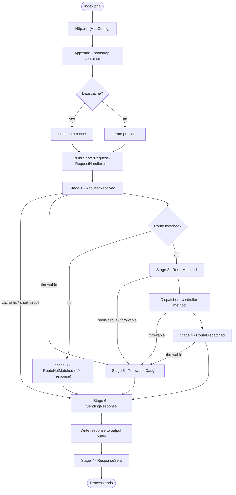
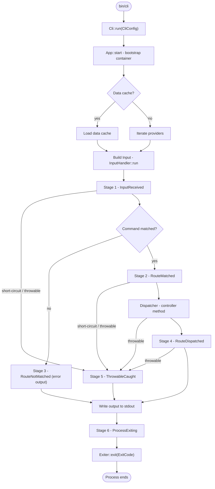
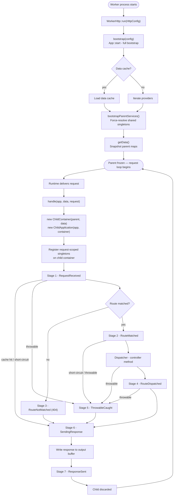

# Request Lifecycle

## Introduction

When building with any framework, understanding what happens under the hood
turns debugging from guesswork into diagnosis, and architectural decisions from
instinct into intention. Valkyrja is designed to be fast, lean, and
transparent — and its lifecycle reflects those values directly. Every step
exists for a reason, and nothing is hidden.

This document walks through the full lifecycle of both an HTTP request and a CLI
command in a Valkyrja application, from the first line of code executed to the
final response sent or process exited.

## Entry Points

Every Valkyrja application has one of three entry points depending on its
runtime.

**HTTP** — your web server points to `app/public/index.php`. This file is
intentionally minimal: it constructs your configuration object and calls
`run()`:

```php
use Valkyrja\Application\Data\HttpConfig;
use Valkyrja\Application\Entry\Http;

Http::run(new HttpConfig(
    dir: __DIR__ . '/..', // This is the application or module root directory (./app in this case)
));
```

**CLI** — commands are invoked via `php app/bin/cli <command-name>`. The `cli`
file follows the same pattern:

```php
use Valkyrja\Application\Data\CliConfig;
use Valkyrja\Application\Entry\Cli;

Cli::run(new CliConfig(
    dir: __DIR__ . '/..', // This is the application or module root directory (./app in this case)
    applicationName: 'myapp',
));
```

**Persistent Worker** — for long-running runtimes such as FrankenPHP,
OpenSwoole, and RoadRunner, where a single PHP process handles many requests
without restarting. The entry class is runtime-specific but follows the same
`run()` convention:

```php
use Valkyrja\Application\Data\HttpConfig;
use Valkyrja\FrankenPhp\FrankenPhpHttp;

FrankenPhpHttp::run(new HttpConfig(
    dir: __DIR__ . '/..', // This is the application or module root directory (./app in this case)
));
```

Worker entry classes are provided as separate packages — see
[Worker Mode](#worker-mode-persistent-runtimes) below for the lifecycle details
and the available runtime integrations.

All three entry classes exist to give the framework one canonical place to
evolve the bootstrap sequence. Your entry point files call `run()` and are done.

In our examples we're using a module approach where the application code lives
not in the root of the project folder, but in an app folder. This can allow you
to have multiple modules together with their own entry points, and also have
shared code outside the modules in the project root. If you only have on
application you do not need to follow this approach.

## The Bootstrap Sequence

`run()` delegates to `start()`, which performs three steps before anything else
happens:

**1. Start time.** The constant `APP_START` is defined as the current microtime.
You can reference this anywhere in your application to measure elapsed time from
the first instruction.

**2. Working directory.** The application's base path is set to the `dir` value
from your configuration. All framework path resolution uses this as its root, so
file lookups behave consistently regardless of where the PHP process was invoked
from.

**3. Application instantiation.** A new container is created. The container,
along with your configuration object, is passed to a new
`Valkyrja\Application\Kernel\Valkyrja` instance. This instance is the
application — it holds the container, exposes the configuration, and coordinates
component loading.

Several core singletons are immediately registered into the container:
`Config`, the concrete config class (e.g. `HttpConfig`), `ContainerContract`,
and `ApplicationContract` itself. If a `CliConfig` is in use, its embedded
`HttpConfig` is also registered.

## Loading Components

With the application instantiated, Valkyrja determines how to populate the
container.

### Without the Data Cache

When `debugMode` is `true` (or no data cache exists), the application iterates
through the component providers listed in your configuration's `providers`
array. Each component provider is asked for its container service providers,
which are registered into the container's deferred service map. Routes and
events are loaded the same way via `getHttpProviders()`, `getCliProviders()`,
and `getEventProviders()`.

No services are instantiated at this stage — the container only builds a map of
what exists and how to create it. Services are resolved lazily, on first access.

### With the Data Cache

In production, a pre-generated PHP data class captures the fully resolved
container state. When this file exists and `debugMode` is `false`, the framework
loads it directly — no provider iteration, no service binding logic, no
reflection. The container is populated in a single step.

This is what makes Valkyrja faster than a micro-framework in production.
Generate the cache after any deployment:

```bash
php app/bin/cli data:generate        # CLI routing data
php app/bin/cli http:data:generate   # HTTP routing data
```

> Note: That a service provider must exist that provides the data classes
> respective for each of the components you expect to load data from with debug
> mode disabled. Otherwise, even with debug mode disabled, the default data
> class will be generated via the same logic loop as without the data cache.

## HTTP: Handling the Request

Once the container is ready, `Http::run()` resolves the `RequestHandlerContract`
from the container, builds a `ServerRequest` from PHP's superglobals via
`RequestFactory::fromGlobals()`, and calls `RequestHandler::run($request)`.

The request then passes through a **seven-stage middleware pipeline**:

### Stage 1 — Request Received (always)

Before any routing occurs. Global middleware runs here — maintenance mode
checks, rate limiting, full-response cache lookups. Middleware at this stage can
either return a modified request (to continue) or return a response directly (
short-circuiting all remaining stages).

### Stage 2 — Route Matched (only if a route was found)

After the `Matcher` finds a matching route, before the handler is dispatched.
Per-route middleware runs here — authentication, authorization, tenant
resolution, validation, etc. Can short-circuit with a response.

### Stage 3 — Route Not Matched (only if a route was not found)

When no route matches the request. A default 404 response is produced; global
middleware at this stage can replace it with a custom not-found page or fallback
handler.

### Stage 4 — Route Dispatched (only if a route was found)

After the matched route's controller method has executed and returned a
response. Global and then per-route middleware here handles post-dispatch
concerns: adding headers, transforming response bodies, logging.

### Stage 5 — Throwable Caught (only if a throwable was caught)

When any `Throwable` is caught during request handling. Receives the throwable
alongside a default error response. Global and then per-route (assuming a route
was found) middleware here handles error reporting and custom error responses.

### Stage 6 — Sending Response (always)

After the response is finalized, before it is written to the output. Global and
then per-route (assuming a route was found) middleware here handles final
modifications: CORS headers, response compression, cache-control headers.

### Stage 7 — Response Sent (always)

After the response has been sent to the client. Global and then per-route
(assuming a route was found) middleware here handles work that is invisible to
the user. The appropriate stage for deferred side effects: writing logs,
dispatching queued events, cache writes. The `CacheResponseMiddleware` saves
successful responses to disk at this stage, making future identical requests
instantaneous if you include it.

After `ResponseSent` middleware completes, the process finishes. Sessions are
closed, FastCGI or Litespeed finish-request hooks are called if available.

## CLI: Handling the Command

Once the container is ready, `Cli::run()` resolves the `InputHandlerContract`
from the container, builds an `Input` object from `$_SERVER['argv']` via
`InputFactory::fromGlobals()`, and calls `InputHandler::run($input)`.

The input passes through a **six-stage middleware pipeline** that mirrors HTTP
exactly:

| HTTP Stage        | CLI Equivalent    | Description                                                 |
| ----------------- | ----------------- | ----------------------------------------------------------- |
| `RequestReceived` | `InputReceived`   | Before routing; can short-circuit with output               |
| `RouteMatched`    | `RouteMatched`    | After match; can short-circuit with output                  |
| `RouteNotMatched` | `RouteNotMatched` | When no command matches                                     |
| `RouteDispatched` | `RouteDispatched` | After dispatch                                              |
| `SendingResponse` | NONE              | There is no equivalent as output can be written at any time |
| `ThrowableCaught` | `ThrowableCaught` | When a throwable is caught                                  |
| `ResponseSent`    | `ProcessExiting`  | After output is written; before process exits               |

After `ProcessExiting` middleware completes, `InputHandler` writes the output's messages
to stdout and calls `Exiter::exit()` with the `ExitCode` integer value from the
output object.

The Cli component does not have an equivalent for the SendingResponse at this
time because output can be sent throughout the pipeline at any point. This is
just due to the nature of an interactive CLI application. The HTTP component has
a SendingResponse stage because there is only one place in the pipeline where
the response is actually sent to the client.

## Worker Mode (Persistent Runtimes)

Persistent worker runtimes — FrankenPHP, OpenSwoole, RoadRunner — keep a single
PHP process alive across many requests. Because state accumulates over time, the
standard PHP-FPM "clean slate per request" guarantee no longer applies. Valkyrja
handles this with an explicit parent/child isolation pattern built into
`Valkyrja\Application\Entry\Abstract\WorkerHttp`.

### The Two-Phase Model

**Phase 1 — Bootstrap (once, at process start)**

`run()` calls `bootstrap()`, which performs the full application bootstrap and
then calls `bootstrapParentServices()`. After this point the parent application
and its container are **frozen** — nothing may write to them again.

```
bootstrap(config)
  └── App::start()                   ← same sequence as Http/Cli
        └── bootstrapParentServices()  ← force-resolve shared singletons
```

A snapshot of the parent container's service maps is captured via `getData()`
before the request loop begins. Because PHP arrays are copy-on-write, passing
this snapshot to each child costs nothing until the child writes to it.

**Phase 2 — Handle (once per request, inside the worker loop)**

For every incoming request, `handle()` creates a fresh `ChildContainer` and
`ChildApplication`. Both inherit from the frozen parent — reads fall through to
the parent transparently — but all writes stay local to the child. When the
request ends the child is discarded and the parent is unmodified.

```
handle(app, data, request)
  ├── new ChildContainer(parent, data)
  ├── new ChildApplication(parent, childContainer)
  ├── Register request-scoped singletons on child
  └── Dispatch request → (same seven-stage pipeline as Http)
```

### Available Runtimes

| Package               | Class                                | Runtime    |
| --------------------- | ------------------------------------ | ---------- |
| `valkyrja/frankenphp` | `Valkyrja\FrankenPhp\FrankenPhpHttp` | FrankenPHP |
| `valkyrja/openswoole` | `Valkyrja\OpenSwoole\OpenSwooleHttp` | OpenSwoole |
| `valkyrja/roadrunner` | `Valkyrja\RoadRunner\RoadRunnerHttp` | RoadRunner |

### Customizing Bootstrap

Override `bootstrapParentServices()` to prepare in the parent whatever a child
would otherwise reach through it:

```php
public static function bootstrapParentServices(ApplicationContract $app): void
{
    // The base resolves the route collection, so keep it.
    parent::bootstrapParentServices($app);

    $container = $app->getContainer();

    // A singleton resolves once here, and every child reuses that instance.
    $container->getSingleton(MyExpensiveSharedService::class);

    // With OrmServiceProvider registered, PDO is published by bind(), so PDO is a
    // service and not a singleton. Publishing puts the factory in the parent, and
    // every child then reaches the factory. Each child still builds its own
    // instance. Warning: publish() returns quietly for an id no provider registers.
    $container->publish(\PDO::class);
}
```

Anything resolved here lives in the frozen parent and is shared read-only across
all requests. A child that holds the publish callback, or the singleton binding
from the data, builds the id fresh in the child's own scope. That is correct,
and the build costs time on every request.

An id the child cannot answer from its own maps goes to the parent, and the
parent answers it as it would for any caller. A parent-declared alias is the
exception: when its target is one the parent has not resolved, the child holds
the same registration and resolves it itself. Resolve here whatever every
request should share. See
[Where an Alias Resolves](Container/README.md#where-an-alias-resolves).

### Child Container Variants

Two implementations are available for the per-request child container:

- **`ChildContainer`** (default) — delegates to the parent via
  `ContainerContract`. Portable and works with any parent that implements the
  contract.
- **`NativeChildContainer`** — accesses the parent's protected fields directly
  for lower construction overhead. Requires a concrete `Container` parent.

The two differ on the factory receiver: a factory bound on the parent receives
the child under `NativeChildContainer`, and the parent under `ChildContainer`. A
parent-declared alias onto a target the parent has already resolved is the
exception, because both hand that call to the parent.

## Focus on Configuration

Valkyrja's configuration philosophy is worth internalizing early because it
shapes everything. Rather than reading from environment variables via a flat map
of string constants, Valkyrja uses **typed PHP config classes** — plain objects
with typed constructor parameters and sensible defaults.

You pass a config object to `run()` and that is your application's entire
configuration. It can contain logic. It can read from `$_ENV`, PHP ini values,
deployment secrets, or anything else. Its properties are typed, IDE-visible, and
statically analysable. There is no indirection, no magic, and no runtime cost
beyond a native PHP object.

The base class is `Valkyrja\Application\Data\Config`. `HttpConfig` and
`CliConfig` extend it, adding runtime-specific properties.
See [The Application](Application/README.md) for a full reference.

## Lifecycle at a Glance

### Standard (HTTP / CLI)

```
index.php / bin/cli
  └── Http::run(HttpConfig) / Cli::run(CliConfig)
        └── App::start()
              ├── Define APP_START
              ├── Set base path (config->dir)
              ├── Create Container
              ├── Create Valkyrja(container, config)
              └── Load components
                    ├── [production] Load data cache class
                    └── [development] Iterate providers → build deferred service map
                          └── HTTP / CLI kernel
                                ├── Build Request / Input from globals
                                ├── Stage 1: RequestReceived / InputReceived
                                ├── Route matching
                                ├── Stage 2: RouteMatched  (or Stage 3: RouteNotMatched)
                                ├── Dispatcher → controller method
                                ├── Stage 4: RouteDispatched
                                ├── [on throw] Stage 5: ThrowableCaught
                                ├── Stage 6: SendingResponse  [HTTP only]
                                ├── Send response / write output
                                └── Stage 7: ResponseSent / ProcessExiting
```

### Worker Mode (Persistent Runtimes)

```
Worker process starts
  └── WorkerHttp::run(HttpConfig)
        └── bootstrap(config)
              └── App::start()                    ← full bootstrap (same as Http)
                    └── bootstrapParentServices()  ← freeze parent; resolve shared singletons
                          └── getData()            ← snapshot parent maps once
                                └── [request loop]
                                      └── handle(app, data, request)
                                            ├── new ChildContainer(parent, data)
                                            ├── new ChildApplication(parent, childContainer)
                                            ├── Register request-scoped singletons on child
                                            └── Dispatch request  ← same seven-stage pipeline
                                                  └── Child discarded → loop repeats
```

### HTTP Lifecycle

<p align="center"><a href="https://valkyrja.io" target="_blank">
    
</a></p>



### CLI Lifecycle

<p align="center"><a href="https://valkyrja.io" target="_blank">
    
</a></p>



### Worker HTTP Lifecycle

<p align="center"><a href="https://valkyrja.io" target="_blank">
    
</a></p>


